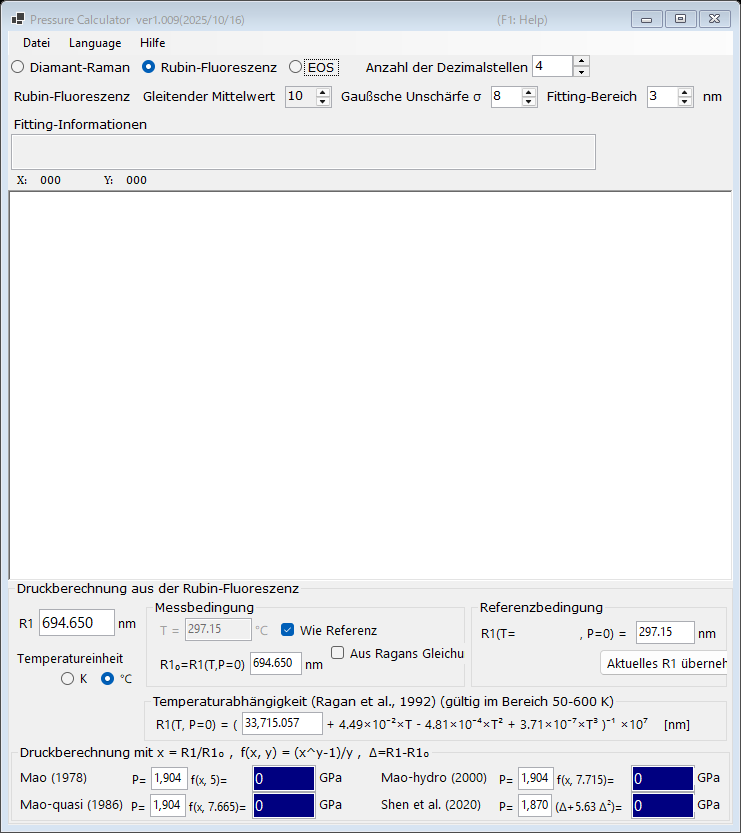

# 1. Rubin-Fluoreszenz

Der Druck wird aus der Verschiebung der R1-Fluoreszenzlinie des Rubins bestimmt, dem am weitesten verbreiteten Druckstandard in Diamantstempelzellen-Experimenten. Wählen Sie oben im Hauptfenster **Rubin-Fluoreszenz**.

{width=700px}

## Arbeitsablauf

1. Laden Sie ein Fluoreszenzspektrum (siehe [Spektren und Fitting](4-spectra-and-fitting.md)), oder geben Sie die R1-Wellenlänge direkt in das Feld **R1** ein (in nm).
2. Ist ein Spektrum geladen, fittet PressureCalculator die R1- und R2-Linien im **Fitting-Bereich** (Pseudo-Voigt-Profile mit linearem Untergrund) und zeigt die gefitteten Peakpositionen und -breiten im Feld **Fitting-Informationen** an.
3. Legen Sie die Referenzbedingung (die R1-Wellenlänge **R1₀** bei Nulldruck) in der Gruppe **Referenzbedingung** fest. **Aktuelles R1 übernehmen** kopiert das aktuell gefittete R1 in das Referenzfeld.
4. Der mit jeder Rubinskala berechnete Druck wird in der Gruppe **Druckberechnung** angezeigt (in GPa).

## Rubinskalen

Der Druck wird berechnet als

$$P = \frac{A}{y}\left[\left(\frac{R1}{R1_0}\right)^{y} - 1\right]$$

mit den folgenden Parametersätzen (die Koeffizienten sind editierbar):

| Skala | Anmerkung |
|---|---|
| Mao (1978) | A = 1904 GPa, y = 5 |
| Mao-quasi (1986) | quasihydrostatische Bedingungen, y = 7.665 |
| Mao-hydro (2000) | hydrostatische Bedingungen, y = 7.715 |
| Shen et al. (2020) | internationale praktische Rubinskala, P = 1870 × Δ(1 + 5.63 Δ), Δ = (R1 − R1₀)/R1₀ |

## Temperaturkorrektur

Die R1-Linie verschiebt sich auch mit der Temperatur. Die Gruppe **Temperaturabhängigkeit (Ragan et al., 1992)** korrigiert diesen Effekt anhand der gemessenen Temperatur und der Referenztemperatur; sie ist im Bereich von 50-600 K anwendbar.

- **Temperatureinheit** : Kelvin oder Celsius.
- **Wie Referenz** : Es wird angenommen, dass die Messtemperatur gleich der Referenztemperatur ist.
- **Aus Ragans Gleichung berechnen** : R1₀ bei der gegebenen Temperatur aus Ragans Gleichung berechnen, statt den Wert manuell einzugeben.
