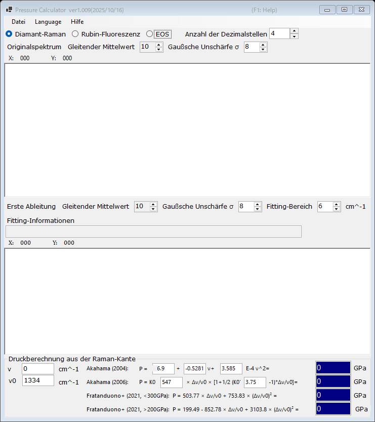

# 2. Diamant-Raman-Kante

Der Druck wird aus der hochfrequenten Kante der Raman-Bande des Diamantstempels abgeschätzt, die der Normalspannung an der Culet-Fläche folgt. Dieser Druckstandard ist bei sehr hohen Drücken praktisch, bei denen die Rubin-Fluoreszenz schwach wird. Wählen Sie oben im Hauptfenster **Diamant-Raman**.

{width=700px}

## Arbeitsablauf

1. Laden Sie ein Raman-Spektrum des Diamantstempels (siehe [Spektren und Fitting](4-spectra-and-fitting.md)). Der obere Graph zeigt das ursprüngliche (geglättete) Spektrum.
2. Der untere Graph zeigt die **Erste Ableitung** des Spektrums. Die hochfrequente Kante erscheint als Minimum der Ableitung; PressureCalculator fittet sie im **Fitting-Bereich** und gibt die Kantenposition im Feld **Fitting-Informationen** an.
3. Legen Sie die Referenzwellenzahl **ν₀** fest (die Raman-Kante bei Nulldruck; standardmäßig 1334 cm⁻¹) und bearbeiten Sie bei Bedarf die gemessene Kante **ν** direkt.
4. Der mit jeder Skala berechnete Druck wird in der Gruppe **Druckberechnung aus der Raman-Kante** angezeigt (in GPa).

Sowohl das Originalspektrum als auch die Ableitung können unabhängig voneinander mit den Filtern **Gleitender Mittelwert** und **Gaußsche Unschärfe σ** geglättet werden (siehe [Spektren und Fitting](4-spectra-and-fitting.md)).

## Skalen für die Raman-Kante

| Skala | Anmerkung |
|---|---|
| Akahama (2004) | Polynom in der Kantenposition; die Koeffizienten sind editierbar |
| Akahama (2006) | P = K₀ x [1 + ½(K₀′ − 1) x], x = Δν/ν₀, mit editierbarem K₀ (547 GPa) und K₀′ (3.75); kalibriert bis in den Multimegabar-Bereich |
| Fratanduono et al. (2021, <300 GPa) | P = 503.77 x + 753.83 x² |
| Fratanduono et al. (2021, >200 GPa) | P = 199.49 − 852.78 x + 3103.8 x² |

Die beiden Zweige von Fratanduono et al. (2021) überlappen sich zwischen 200 und 300 GPa; verwenden Sie den für Ihren Druckbereich geeigneten Zweig.
