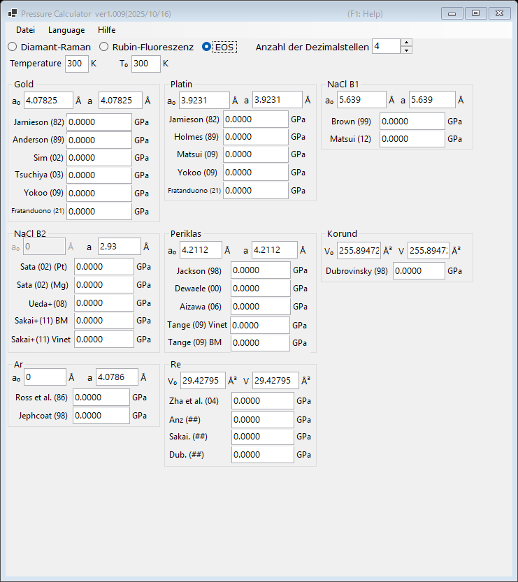

# 3. Zustandsgleichung (EOS)

Der Druck wird aus der gemessenen Gitterkonstante (oder dem Elementarzellenvolumen) eines Standardmaterials anhand publizierter Zustandsgleichungen bestimmt. Dies ist die Standardmethode in Röntgenbeugungsexperimenten unter hohem Druck. Wählen Sie oben im Hauptfenster **EOS**.

{width=700px}

## Arbeitsablauf

1. Geben Sie die Messtemperatur **Temperature** und die Referenztemperatur **T₀** ein (in K). Thermische Zustandsgleichungen verwenden diese Werte; Raumtemperatur-Skalen ignorieren die Differenz.
2. Geben Sie für jedes Standardmaterial die Gitterkonstante bei Umgebungsbedingungen **a₀** (Å) und die gemessene Gitterkonstante **a** (Å) ein. Für Korund und Rhenium werden stattdessen die Elementarzellenvolumina **V₀** und **V** (ų) eingegeben.
3. Der mit jeder publizierten Skala berechnete Druck wird sofort angezeigt (in GPa).

## Verfügbare Standards und Skalen

| Material | Skalen |
|---|---|
| Gold | Jamieson (1982), Anderson (1989), Sim (2002), Tsuchiya (2003), Yokoo (2009), Fratanduono (2021) |
| Platin | Jamieson (1982), Holmes (1989), Matsui (2009), Yokoo (2009), Fratanduono (2021) |
| NaCl B1 | Brown (1999), Matsui (2012) |
| NaCl B2 | Sata (2002) (Pt/Mg-Druckreferenzen), Ueda+ (2008), Sakai+ (2011) BM/Vinet |
| Periklas (MgO) | Jackson (1998), Dewaele (2000), Aizawa (2006), Tange (2009) Vinet/BM |
| Korund (Al₂O₃) | Dubrovinsky (1998) |
| Ar | Ross et al. (1986), Jephcoat (1998) |
| Re | Zha et al. (2004) und andere |
| Mo | Zhao+ (2000), Huang+ (2016) MGD |
| Pb | Strässle+ (2014) |

!!! note
    Verschiedene Skalen für dasselbe Material können um mehrere Prozent voneinander abweichen, insbesondere bei Drücken im Multimegabar-Bereich. Geben Sie bei der Veröffentlichung von Ergebnissen an, welche Skala verwendet wurde.
