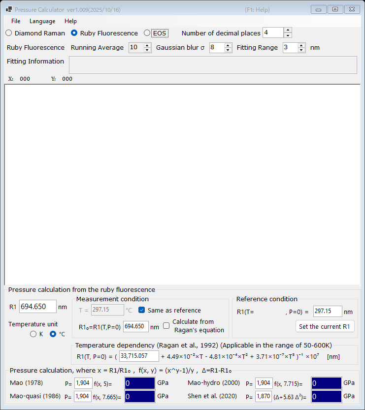

# 1. Ruby fluorescence

Pressure is determined from the shift of the ruby R1 fluorescence line, the most widely used pressure gauge in diamond-anvil-cell experiments. Select **Ruby Fluorescence** at the top of the main window.

{width=700px}

## Workflow

1. Load a fluorescence spectrum (see [Spectra and fitting](4-spectra-and-fitting.md)), or type the R1 wavelength directly into the **R1** box (in nm).
2. When a spectrum is loaded, PressureCalculator fits the R1 and R2 lines within the **Fitting Range** (pseudo-Voigt profiles with a linear background) and displays the fitted peak positions and widths in the **Fitting Information** box.
3. Set the reference condition (the R1 wavelength **R1₀** at zero pressure) in the **Reference condition** group. **Set the current R1** copies the currently fitted R1 into the reference box.
4. The pressure calculated with each ruby scale is displayed in the **Pressure calculation** group (in GPa).

## Ruby scales

The pressure is calculated as

$$P = \frac{A}{y}\left[\left(\frac{R1}{R1_0}\right)^{y} - 1\right]$$

with the following parameter sets (the coefficients are editable):

| Scale | Note |
|---|---|
| Mao (1978) | A = 1904 GPa, y = 5 |
| Mao-quasi (1986) | quasi-hydrostatic conditions, y = 7.665 |
| Mao-hydro (2000) | hydrostatic conditions, y = 7.715 |
| Shen et al. (2020) | international practical ruby scale, P = 1870 × Δ(1 + 5.63 Δ), Δ = (R1 − R1₀)/R1₀ |

## Temperature correction

The R1 line also shifts with temperature. The **Temperature dependency (Ragan et al., 1992)** group corrects for this effect, using the measured temperature and the reference temperature; it is applicable in the range of 50-600 K.

- **Temperature unit** : Kelvin or Celsius.
- **Same as reference** : assume the measurement temperature equals the reference temperature.
- **Calculate from Ragan's equation** : compute R1₀ at the given temperature from Ragan's equation instead of typing it manually.
