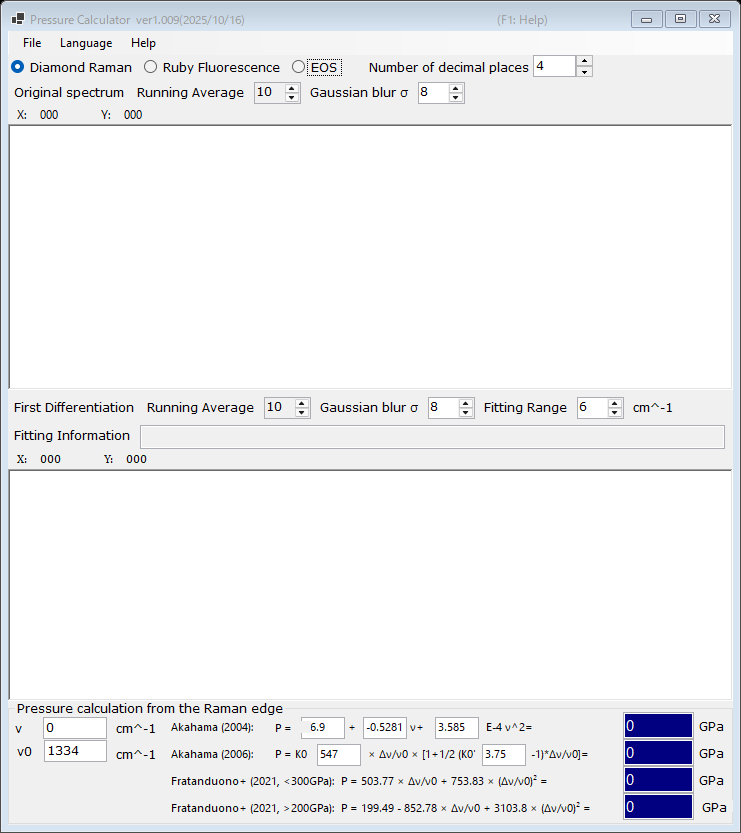

# 2. Diamond Raman edge

Pressure is estimated from the high-frequency edge of the Raman band of the diamond anvil, which tracks the normal stress at the culet face. This gauge is convenient at very high pressures where ruby fluorescence becomes weak. Select **Diamond Raman** at the top of the main window.

{width=700px}

## Workflow

1. Load a Raman spectrum of the diamond anvil (see [Spectra and fitting](4-spectra-and-fitting.md)). The upper graph shows the original (smoothed) spectrum.
2. The lower graph shows the **First Differentiation** of the spectrum. The high-frequency edge appears as a minimum of the derivative; PressureCalculator fits it within the **Fitting Range** and reports the edge position in the **Fitting Information** box.
3. Set the reference wavenumber **ν₀** (the Raman edge at zero pressure; 1334 cm⁻¹ by default) and, if needed, edit the measured edge **ν** directly.
4. The pressure calculated with each scale is displayed in the **Pressure calculation from the Raman edge** group (in GPa).

Both the original spectrum and the derivative can be smoothed independently with a **Running Average** and a **Gaussian blur σ** (see [Spectra and fitting](4-spectra-and-fitting.md)).

## Raman edge scales

| Scale | Note |
|---|---|
| Akahama (2004) | polynomial in the edge position; the coefficients are editable |
| Akahama (2006) | P = K₀ x [1 + ½(K₀′ − 1) x], x = Δν/ν₀, with editable K₀ (547 GPa) and K₀′ (3.75); calibrated up to the multimegabar range |
| Fratanduono et al. (2021, <300 GPa) | P = 503.77 x + 753.83 x² |
| Fratanduono et al. (2021, >200 GPa) | P = 199.49 − 852.78 x + 3103.8 x² |

The two Fratanduono et al. (2021) branches overlap between 200 and 300 GPa; use the branch appropriate for your pressure range.
