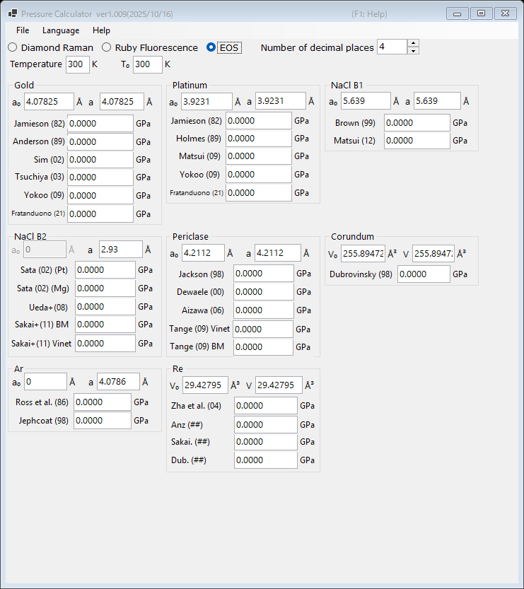

# 3. Equation of states (EOS)

Pressure is determined from the measured lattice constant (or unit-cell volume) of a standard material, using published equations of state. This is the standard method in X-ray diffraction experiments under high pressure. Select **EOS** at the top of the main window.

{width=700px}

## Workflow

1. Enter the measurement temperature **Temperature** and the reference temperature **T₀** (in K). Thermal equations of state use them; room-temperature scales ignore the difference.
2. For each standard material, enter the ambient lattice constant **a₀** (Å) and the measured lattice constant **a** (Å). For corundum and rhenium, the unit-cell volumes **V₀** and **V** (ų) are entered instead.
3. The pressure calculated with each published scale is displayed immediately (in GPa).

## Available standards and scales

| Material | Scales |
|---|---|
| Gold | Jamieson (1982), Anderson (1989), Sim (2002), Tsuchiya (2003), Yokoo (2009), Fratanduono (2021) |
| Platinum | Jamieson (1982), Holmes (1989), Matsui (2009), Yokoo (2009), Fratanduono (2021) |
| NaCl B1 | Brown (1999), Matsui (2012) |
| NaCl B2 | Sata (2002) (Pt/Mg pressure references), Ueda+ (2008), Sakai+ (2011) BM/Vinet |
| Periclase (MgO) | Jackson (1998), Dewaele (2000), Aizawa (2006), Tange (2009) Vinet/BM |
| Corundum (Al₂O₃) | Dubrovinsky (1998) |
| Ar | Ross et al. (1986), Jephcoat (1998) |
| Re | Zha et al. (2004) and others |
| Mo | Zhao+ (2000), Huang+ (2016) MGD |
| Pb | Strässle+ (2014) |

!!! note
    Different scales for the same material can disagree by several percent, particularly at multimegabar pressures. Report which scale was used when publishing results.
