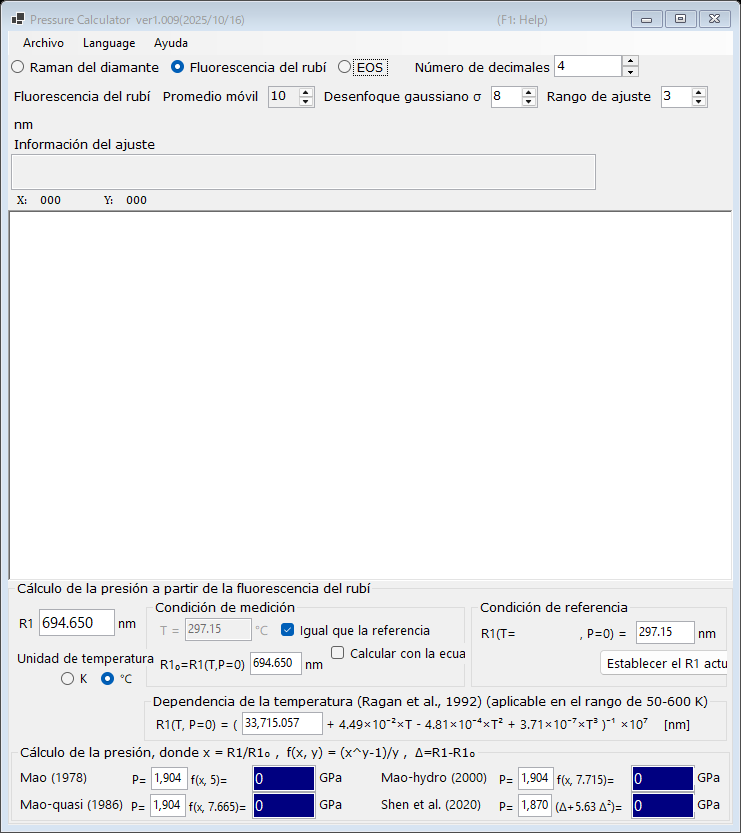

# 1. Fluorescencia del rubí

La presión se determina a partir del desplazamiento de la línea de fluorescencia R1 del rubí, el sensor de presión más utilizado en los experimentos con celda de yunques de diamante. Seleccione **Fluorescencia del rubí** en la parte superior de la ventana principal.

{width=700px}

## Flujo de trabajo

1. Cargue un espectro de fluorescencia (véase [Espectros y ajuste](4-spectra-and-fitting.md)) o escriba directamente la longitud de onda de R1 en el cuadro **R1** (en nm).
2. Cuando hay un espectro cargado, PressureCalculator ajusta las líneas R1 y R2 dentro del **Rango de ajuste** (perfiles pseudo-Voigt con un fondo lineal) y muestra las posiciones y anchuras de los picos ajustados en el cuadro **Información del ajuste**.
3. Establezca la condición de referencia (la longitud de onda **R1₀** de la línea R1 a presión cero) en el grupo **Condición de referencia**. **Establecer el R1 actual** copia el R1 ajustado en ese momento al cuadro de referencia.
4. La presión calculada con cada escala de rubí se muestra en el grupo **Cálculo de la presión** (en GPa).

## Escalas de rubí

La presión se calcula como

$$P = \frac{A}{y}\left[\left(\frac{R1}{R1_0}\right)^{y} - 1\right]$$

con los siguientes conjuntos de parámetros (los coeficientes son editables):

| Escala | Nota |
|---|---|
| Mao (1978) | A = 1904 GPa, y = 5 |
| Mao-quasi (1986) | condiciones cuasihidrostáticas, y = 7.665 |
| Mao-hydro (2000) | condiciones hidrostáticas, y = 7.715 |
| Shen et al. (2020) | escala de rubí práctica internacional, P = 1870 × Δ(1 + 5.63 Δ), Δ = (R1 − R1₀)/R1₀ |

## Corrección de temperatura

La línea R1 también se desplaza con la temperatura. El grupo **Dependencia de la temperatura (Ragan et al., 1992)** corrige este efecto utilizando la temperatura medida y la temperatura de referencia; es aplicable en el rango de 50-600 K.

- **Unidad de temperatura** : Kelvin o Celsius.
- **Igual que la referencia** : supone que la temperatura de medición es igual a la temperatura de referencia.
- **Calcular con la ecuación de Ragan** : calcula R1₀ a la temperatura indicada mediante la ecuación de Ragan, en lugar de introducirlo manualmente.
