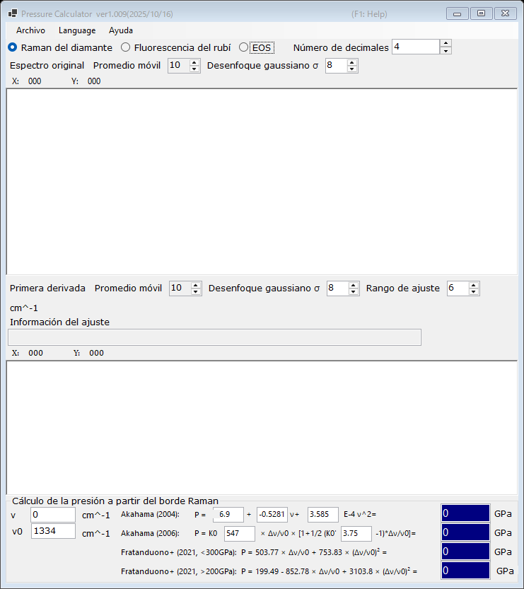

# 2. Borde Raman del diamante

La presión se estima a partir del borde de alta frecuencia de la banda Raman del yunque de diamante, que sigue la tensión normal en la cara del culet. Este sensor resulta muy útil a presiones muy altas, donde la fluorescencia del rubí se vuelve débil. Seleccione **Raman del diamante** en la parte superior de la ventana principal.

{width=700px}

## Flujo de trabajo

1. Cargue un espectro Raman del yunque de diamante (véase [Espectros y ajuste](4-spectra-and-fitting.md)). El gráfico superior muestra el espectro original (suavizado).
2. El gráfico inferior muestra la **Primera derivada** del espectro. El borde de alta frecuencia aparece como un mínimo de la derivada; PressureCalculator lo ajusta dentro del **Rango de ajuste** e indica la posición del borde en el cuadro **Información del ajuste**.
3. Establezca el número de onda de referencia **ν₀** (el borde Raman a presión cero; 1334 cm⁻¹ por defecto) y, si es necesario, edite directamente el borde medido **ν**.
4. La presión calculada con cada escala se muestra en el grupo **Cálculo de la presión a partir del borde Raman** (en GPa).

Tanto el espectro original como la derivada pueden suavizarse de forma independiente con un **Promedio móvil** y un **Desenfoque gaussiano σ** (véase [Espectros y ajuste](4-spectra-and-fitting.md)).

## Escalas del borde Raman

| Escala | Nota |
|---|---|
| Akahama (2004) | polinomio en la posición del borde; los coeficientes son editables |
| Akahama (2006) | P = K₀ x [1 + ½(K₀′ − 1) x], x = Δν/ν₀, con K₀ (547 GPa) y K₀′ (3.75) editables; calibrada hasta el rango multimegabar |
| Fratanduono et al. (2021, <300 GPa) | P = 503.77 x + 753.83 x² |
| Fratanduono et al. (2021, >200 GPa) | P = 199.49 − 852.78 x + 3103.8 x² |

Las dos ramas de Fratanduono et al. (2021) se solapan entre 200 y 300 GPa; utilice la rama apropiada para su rango de presión.
