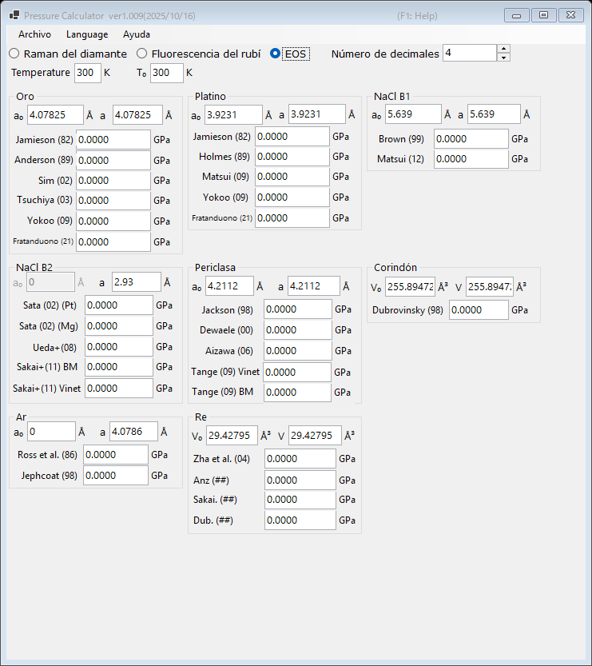

# 3. Ecuación de estado (EOS)

La presión se determina a partir de la constante de red (o del volumen de la celda unidad) medida de un material estándar, utilizando ecuaciones de estado publicadas. Es el método estándar en los experimentos de difracción de rayos X a alta presión. Seleccione **EOS** en la parte superior de la ventana principal.

{width=700px}

## Flujo de trabajo

1. Introduzca la temperatura de medición **Temperature** y la temperatura de referencia **T₀** (en K). Las ecuaciones de estado térmicas las utilizan; las escalas a temperatura ambiente ignoran la diferencia.
2. Para cada material estándar, introduzca la constante de red en condiciones ambientales **a₀** (Å) y la constante de red medida **a** (Å). Para el corindón y el renio se introducen en su lugar los volúmenes de la celda unidad **V₀** y **V** (ų).
3. La presión calculada con cada escala publicada se muestra de inmediato (en GPa).

## Estándares y escalas disponibles

| Material | Escalas |
|---|---|
| Oro | Jamieson (1982), Anderson (1989), Sim (2002), Tsuchiya (2003), Yokoo (2009), Fratanduono (2021) |
| Platino | Jamieson (1982), Holmes (1989), Matsui (2009), Yokoo (2009), Fratanduono (2021) |
| NaCl B1 | Brown (1999), Matsui (2012) |
| NaCl B2 | Sata (2002) (referencias de presión Pt/Mg), Ueda+ (2008), Sakai+ (2011) BM/Vinet |
| Periclasa (MgO) | Jackson (1998), Dewaele (2000), Aizawa (2006), Tange (2009) Vinet/BM |
| Corindón (Al₂O₃) | Dubrovinsky (1998) |
| Ar | Ross et al. (1986), Jephcoat (1998) |
| Re | Zha et al. (2004) y otros |
| Mo | Zhao+ (2000), Huang+ (2016) MGD |
| Pb | Strässle+ (2014) |

!!! note
    Distintas escalas para un mismo material pueden discrepar en varios por ciento, especialmente a presiones multimegabar. Al publicar los resultados, indique qué escala se ha utilizado.
