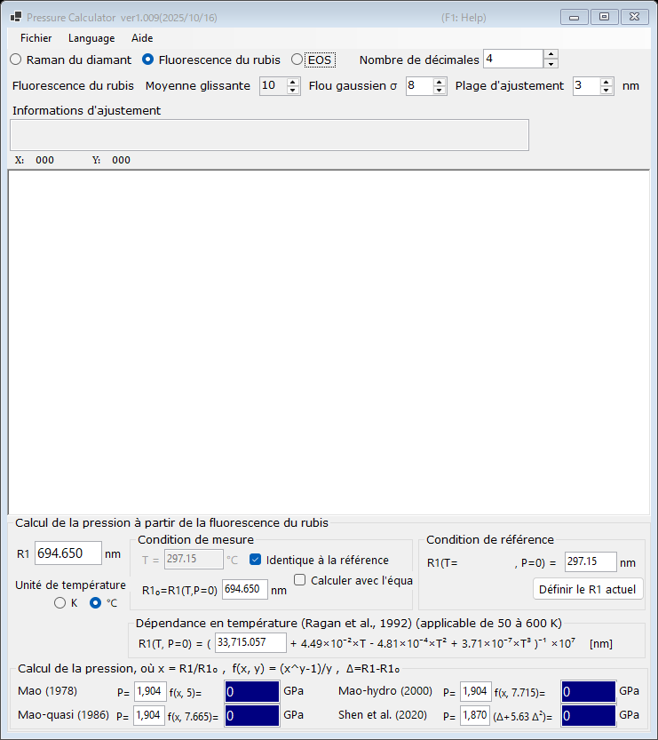

# 1. Fluorescence du rubis

La pression est déterminée à partir du déplacement de la raie de fluorescence R1 du rubis, la jauge de pression la plus utilisée dans les expériences en cellule à enclumes de diamant. Sélectionnez **Fluorescence du rubis** en haut de la fenêtre principale.

{width=700px}

## Procédure

1. Chargez un spectre de fluorescence (voir [Spectres et ajustement](4-spectra-and-fitting.md)), ou saisissez directement la longueur d'onde de la raie R1 dans la case **R1** (en nm).
2. Lorsqu'un spectre est chargé, PressureCalculator ajuste les raies R1 et R2 à l'intérieur de la **Plage d'ajustement** (profils pseudo-Voigt avec un fond linéaire) et affiche les positions et les largeurs des pics ajustés dans la zone **Informations d'ajustement**.
3. Définissez la condition de référence (la longueur d'onde R1 à pression nulle, **R1₀**) dans le groupe **Condition de référence**. Le bouton **Définir le R1 actuel** copie le R1 actuellement ajusté dans la case de référence.
4. La pression calculée avec chaque échelle rubis est affichée dans le groupe **Calcul de la pression** (en GPa).

## Échelles rubis

La pression est calculée selon

$$P = \frac{A}{y}\left[\left(\frac{R1}{R1_0}\right)^{y} - 1\right]$$

avec les jeux de paramètres suivants (les coefficients sont modifiables) :

| Échelle | Remarque |
|---|---|
| Mao (1978) | A = 1904 GPa, y = 5 |
| Mao-quasi (1986) | conditions quasi hydrostatiques, y = 7.665 |
| Mao-hydro (2000) | conditions hydrostatiques, y = 7.715 |
| Shen et al. (2020) | échelle rubis pratique internationale, P = 1870 × Δ(1 + 5.63 Δ), Δ = (R1 − R1₀)/R1₀ |

## Correction en température

La raie R1 se déplace également avec la température. Le groupe **Dépendance en température (Ragan et al., 1992)** corrige cet effet à partir de la température mesurée et de la température de référence ; il est applicable dans la plage de 50 à 600 K.

- **Unité de température** : Kelvin ou Celsius.
- **Identique à la référence** : considère que la température de mesure est égale à la température de référence.
- **Calculer avec l'équation de Ragan** : calcule R1₀ à la température indiquée à partir de l'équation de Ragan, au lieu de le saisir manuellement.
