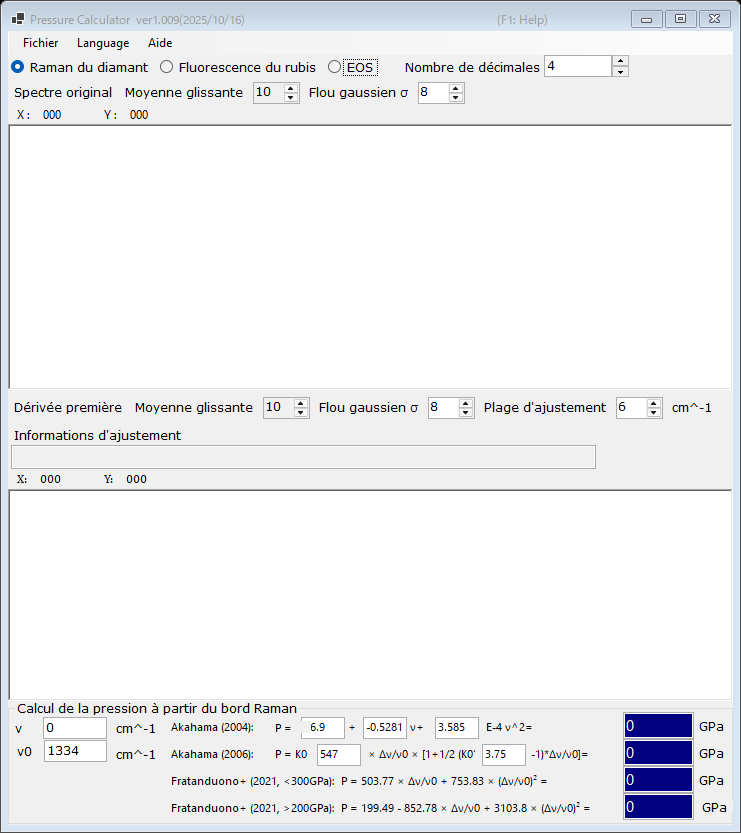

# 2. Bord Raman du diamant

La pression est estimée à partir du bord haute fréquence de la bande Raman de l'enclume en diamant, qui suit la contrainte normale à la face du culet. Cette jauge est commode aux très hautes pressions, là où la fluorescence du rubis devient faible. Sélectionnez **Raman du diamant** en haut de la fenêtre principale.

{width=700px}

## Procédure

1. Chargez un spectre Raman de l'enclume en diamant (voir [Spectres et ajustement](4-spectra-and-fitting.md)). Le graphique supérieur montre le spectre original (lissé).
2. Le graphique inférieur montre la **Dérivée première** du spectre. Le bord haute fréquence apparaît comme un minimum de la dérivée ; PressureCalculator l'ajuste à l'intérieur de la **Plage d'ajustement** et indique la position du bord dans la zone **Informations d'ajustement**.
3. Définissez le nombre d'onde de référence **ν₀** (le bord Raman à pression nulle ; 1334 cm⁻¹ par défaut) et, si nécessaire, modifiez directement le bord mesuré **ν**.
4. La pression calculée avec chaque échelle est affichée dans le groupe **Calcul de la pression à partir du bord Raman** (en GPa).

Le spectre original et la dérivée peuvent être lissés indépendamment au moyen d'une **Moyenne glissante** et d'un **Flou gaussien σ** (voir [Spectres et ajustement](4-spectra-and-fitting.md)).

## Échelles du bord Raman

| Échelle | Remarque |
|---|---|
| Akahama (2004) | polynôme en fonction de la position du bord ; les coefficients sont modifiables |
| Akahama (2006) | P = K₀ x [1 + ½(K₀′ − 1) x], x = Δν/ν₀, avec K₀ (547 GPa) et K₀′ (3.75) modifiables ; étalonnée jusqu'au domaine multimégabar |
| Fratanduono et al. (2021, <300 GPa) | P = 503.77 x + 753.83 x² |
| Fratanduono et al. (2021, >200 GPa) | P = 199.49 − 852.78 x + 3103.8 x² |

Les deux branches de Fratanduono et al. (2021) se recouvrent entre 200 et 300 GPa ; utilisez la branche adaptée à votre gamme de pression.
