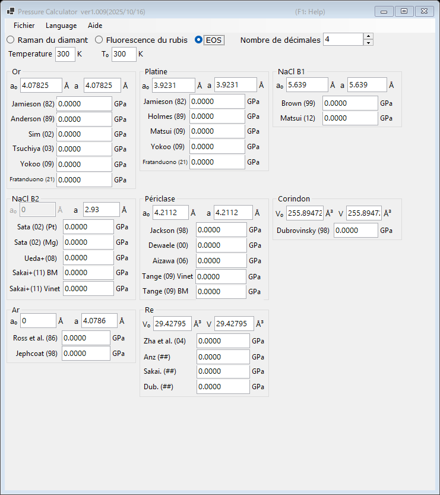

# 3. Équation d'état (EOS)

La pression est déterminée à partir du paramètre de maille (ou du volume de la maille) mesuré d'un matériau étalon, au moyen d'équations d'état publiées. C'est la méthode standard des expériences de diffraction des rayons X sous haute pression. Sélectionnez **EOS** en haut de la fenêtre principale.

{width=700px}

## Procédure

1. Saisissez la température de mesure **Temperature** et la température de référence **T₀** (en K). Les équations d'état thermiques les utilisent ; les échelles à température ambiante ignorent la différence.
2. Pour chaque matériau étalon, saisissez le paramètre de maille aux conditions ambiantes **a₀** (Å) et le paramètre de maille mesuré **a** (Å). Pour le corindon et le rhénium, ce sont les volumes de maille **V₀** et **V** (ų) qui sont saisis à la place.
3. La pression calculée avec chaque échelle publiée s'affiche immédiatement (en GPa).

## Matériaux étalons et échelles disponibles

| Matériau | Échelles |
|---|---|
| Or | Jamieson (1982), Anderson (1989), Sim (2002), Tsuchiya (2003), Yokoo (2009), Fratanduono (2021) |
| Platine | Jamieson (1982), Holmes (1989), Matsui (2009), Yokoo (2009), Fratanduono (2021) |
| NaCl B1 | Brown (1999), Matsui (2012) |
| NaCl B2 | Sata (2002) (références de pression Pt/Mg), Ueda+ (2008), Sakai+ (2011) BM/Vinet |
| Périclase (MgO) | Jackson (1998), Dewaele (2000), Aizawa (2006), Tange (2009) Vinet/BM |
| Corindon (Al₂O₃) | Dubrovinsky (1998) |
| Ar | Ross et al. (1986), Jephcoat (1998) |
| Re | Zha et al. (2004) et autres |
| Mo | Zhao+ (2000), Huang+ (2016) MGD |
| Pb | Strässle+ (2014) |

!!! note
    Des échelles différentes pour un même matériau peuvent diverger de plusieurs pour cent, en particulier aux pressions multimégabar. Indiquez l'échelle utilisée lors de la publication de vos résultats.
