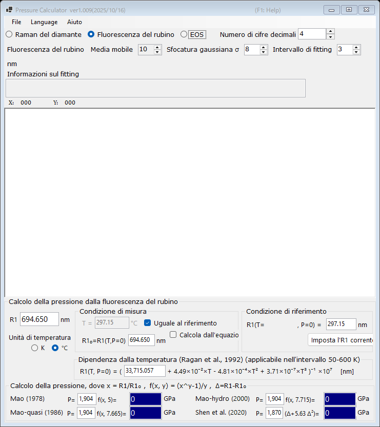

# 1. Fluorescenza del rubino

La pressione viene determinata dallo spostamento della riga di fluorescenza R1 del rubino, il manometro più utilizzato negli esperimenti con cella a incudini di diamante. Selezionare **Fluorescenza del rubino** nella parte superiore della finestra principale.

{width=700px}

## Procedura

1. Caricare uno spettro di fluorescenza (si veda [Spettri e fitting](4-spectra-and-fitting.md)), oppure digitare direttamente la lunghezza d'onda R1 nella casella **R1** (in nm).
2. Quando uno spettro è caricato, PressureCalculator esegue il fitting delle righe R1 e R2 all'interno dell'**Intervallo di fitting** (profili pseudo-Voigt con fondo lineare) e visualizza le posizioni e le larghezze dei picchi fittati nel riquadro **Informazioni sul fitting**.
3. Impostare la condizione di riferimento (la lunghezza d'onda R1 a pressione nulla, **R1₀**) nel gruppo **Condizione di riferimento**. **Imposta l'R1 corrente** copia l'R1 attualmente fittato nella casella di riferimento.
4. La pressione calcolata con ciascuna scala del rubino è visualizzata nel gruppo **Calcolo della pressione** (in GPa).

## Scale del rubino

La pressione è calcolata come

$$P = \frac{A}{y}\left[\left(\frac{R1}{R1_0}\right)^{y} - 1\right]$$

con i seguenti insiemi di parametri (i coefficienti sono modificabili):

| Scala | Nota |
|---|---|
| Mao (1978) | A = 1904 GPa, y = 5 |
| Mao-quasi (1986) | condizioni quasi-idrostatiche, y = 7.665 |
| Mao-hydro (2000) | condizioni idrostatiche, y = 7.715 |
| Shen et al. (2020) | scala pratica internazionale del rubino, P = 1870 × Δ(1 + 5.63 Δ), Δ = (R1 − R1₀)/R1₀ |

## Correzione di temperatura

La riga R1 si sposta anche con la temperatura. Il gruppo **Dipendenza dalla temperatura (Ragan et al., 1992)** corregge questo effetto utilizzando la temperatura misurata e la temperatura di riferimento; è applicabile nell'intervallo 50-600 K.

- **Unità di temperatura** : kelvin o gradi Celsius.
- **Uguale al riferimento** : assume che la temperatura di misura sia uguale alla temperatura di riferimento.
- **Calcola dall'equazione di Ragan** : calcola R1₀ alla temperatura indicata mediante l'equazione di Ragan invece di digitarlo manualmente.
