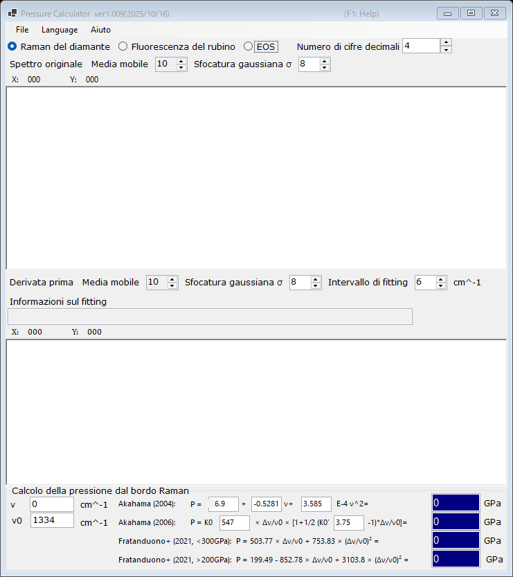

# 2. Bordo Raman del diamante

La pressione viene stimata dal bordo ad alta frequenza della banda Raman dell'incudine di diamante, che segue lo sforzo normale sulla faccia della culet. Questo manometro è comodo alle pressioni molto elevate, dove la fluorescenza del rubino diventa debole. Selezionare **Raman del diamante** nella parte superiore della finestra principale.

{width=700px}

## Procedura

1. Caricare uno spettro Raman dell'incudine di diamante (si veda [Spettri e fitting](4-spectra-and-fitting.md)). Il grafico superiore mostra lo spettro originale (lisciato).
2. Il grafico inferiore mostra la **Derivata prima** dello spettro. Il bordo ad alta frequenza appare come un minimo della derivata; PressureCalculator lo fitta all'interno dell'**Intervallo di fitting** e riporta la posizione del bordo nel riquadro **Informazioni sul fitting**.
3. Impostare il numero d'onda di riferimento **ν₀** (il bordo Raman a pressione nulla; 1334 cm⁻¹ per impostazione predefinita) e, se necessario, modificare direttamente il bordo misurato **ν**.
4. La pressione calcolata con ciascuna scala è visualizzata nel gruppo **Calcolo della pressione dal bordo Raman** (in GPa).

Sia lo spettro originale sia la derivata possono essere lisciati indipendentemente con una **Media mobile** e una **Sfocatura gaussiana σ** (si veda [Spettri e fitting](4-spectra-and-fitting.md)).

## Scale del bordo Raman

| Scala | Nota |
|---|---|
| Akahama (2004) | polinomio nella posizione del bordo; i coefficienti sono modificabili |
| Akahama (2006) | P = K₀ x [1 + ½(K₀′ − 1) x], x = Δν/ν₀, con K₀ (547 GPa) e K₀′ (3.75) modificabili; calibrata fino all'intervallo dei multimegabar |
| Fratanduono et al. (2021, <300 GPa) | P = 503.77 x + 753.83 x² |
| Fratanduono et al. (2021, >200 GPa) | P = 199.49 − 852.78 x + 3103.8 x² |

I due rami di Fratanduono et al. (2021) si sovrappongono tra 200 e 300 GPa; utilizzare il ramo appropriato per il proprio intervallo di pressione.
