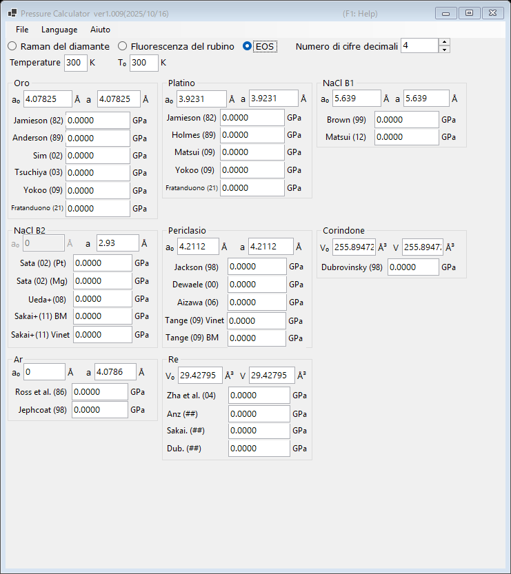

# 3. Equazione di stato (EOS)

La pressione viene determinata dalla costante reticolare misurata (o dal volume della cella unitaria) di un materiale standard, utilizzando equazioni di stato pubblicate. È il metodo standard negli esperimenti di diffrazione dei raggi X ad alta pressione. Selezionare **EOS** nella parte superiore della finestra principale.

{width=700px}

## Procedura

1. Inserire la temperatura di misura **Temperature** e la temperatura di riferimento **T₀** (in K). Le equazioni di stato termiche le utilizzano; le scale a temperatura ambiente ignorano la differenza.
2. Per ciascun materiale standard, inserire la costante reticolare a pressione ambiente **a₀** (Å) e la costante reticolare misurata **a** (Å). Per il corindone e il renio si inseriscono invece i volumi della cella unitaria **V₀** e **V** (ų).
3. La pressione calcolata con ciascuna scala pubblicata è visualizzata immediatamente (in GPa).

## Standard e scale disponibili

| Materiale | Scale |
|---|---|
| Oro | Jamieson (1982), Anderson (1989), Sim (2002), Tsuchiya (2003), Yokoo (2009), Fratanduono (2021) |
| Platino | Jamieson (1982), Holmes (1989), Matsui (2009), Yokoo (2009), Fratanduono (2021) |
| NaCl B1 | Brown (1999), Matsui (2012) |
| NaCl B2 | Sata (2002) (riferimenti di pressione Pt/Mg), Ueda+ (2008), Sakai+ (2011) BM/Vinet |
| Periclasio (MgO) | Jackson (1998), Dewaele (2000), Aizawa (2006), Tange (2009) Vinet/BM |
| Corindone (Al₂O₃) | Dubrovinsky (1998) |
| Ar | Ross et al. (1986), Jephcoat (1998) |
| Re | Zha et al. (2004) e altri |
| Mo | Zhao+ (2000), Huang+ (2016) MGD |
| Pb | Strässle+ (2014) |

!!! note
    Scale diverse per lo stesso materiale possono discostarsi di alcuni punti percentuali, in particolare alle pressioni dei multimegabar. Nel pubblicare i risultati, indicare quale scala è stata utilizzata.
