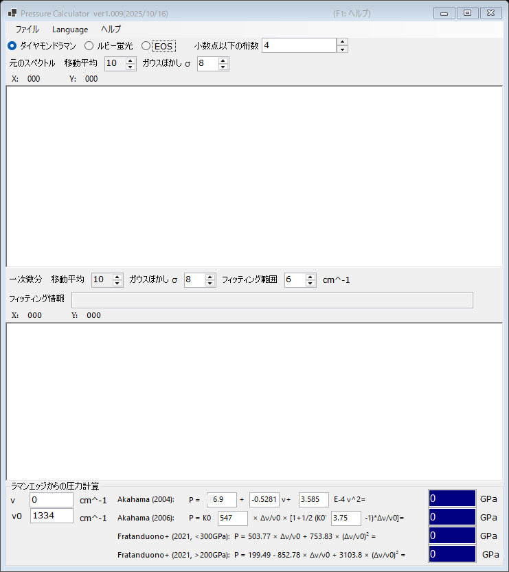

# 2. ダイヤモンドラマンエッジ

ダイヤモンドアンビルのラマンバンドの高波数側エッジはキュレット面の法線応力に追随するため、これから圧力を推定できます。ルビー蛍光が弱くなる超高圧領域で便利なゲージです。メインウィンドウ上部の **ダイヤモンドラマン** を選択してください。

{width=700px}

## 操作の流れ

1. ダイヤモンドアンビルのラマンスペクトルを読み込みます（[スペクトルとフィッティング](4-spectra-and-fitting.md)参照）。上のグラフに元の（平滑化された）スペクトルが表示されます。
2. 下のグラフにはスペクトルの **一次微分** が表示されます。高波数側エッジは微分の極小として現れ、**フィッティング範囲** 内でフィッティングされてエッジ位置が **フィッティング情報** 欄に表示されます。
3. 基準波数 **ν₀**（ゼロ圧力でのラマンエッジ。既定値 1334 cm⁻¹）を設定し、必要なら測定エッジ **ν** を直接編集します。
4. 各スケールで計算された圧力が **ラマンエッジからの圧力計算** グループに表示されます (GPa)。

元のスペクトルと微分は、それぞれ独立に **移動平均** と **ガウスぼかし σ** で平滑化できます（[スペクトルとフィッティング](4-spectra-and-fitting.md)参照）。

## ラマンエッジスケール

| スケール | 備考 |
|---|---|
| Akahama (2004) | エッジ位置の多項式。係数は編集可能 |
| Akahama (2006) | P = K₀ x [1 + ½(K₀′ − 1) x], x = Δν/ν₀。K₀ (547 GPa) と K₀′ (3.75) は編集可能。数百 GPa 領域まで較正 |
| Fratanduono et al. (2021, <300 GPa) | P = 503.77 x + 753.83 x² |
| Fratanduono et al. (2021, >200 GPa) | P = 199.49 − 852.78 x + 3103.8 x² |

Fratanduono et al. (2021) の 2 つの式は 200-300 GPa で重なります。対象とする圧力範囲に応じて使い分けてください。
