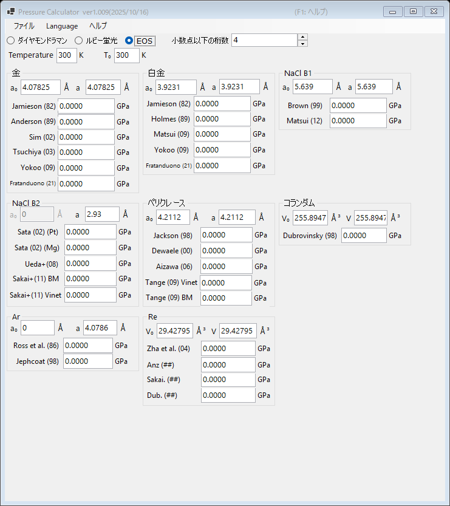

# 3. 状態方程式 (EOS)

公表されている状態方程式を用いて、標準物質の格子定数（または単位胞体積）の測定値から圧力を決定します。高圧下の X 線回折実験における標準的な方法です。メインウィンドウ上部の **EOS** を選択してください。

{width=700px}

## 操作の流れ

1. 測定温度 **Temperature** と参照温度 **T₀** を入力します (K)。熱的状態方程式ではこれらが使われます（室温スケールでは差は無視されます）。
2. 各標準物質について、常圧での格子定数 **a₀** (Å) と測定された格子定数 **a** (Å) を入力します。コランダムとレニウムでは代わりに単位胞体積 **V₀**・**V** (ų) を入力します。
3. 各スケールで計算された圧力が即座に表示されます (GPa)。

## 利用可能な標準物質とスケール

| 物質 | スケール |
|---|---|
| 金 | Jamieson (1982), Anderson (1989), Sim (2002), Tsuchiya (2003), Yokoo (2009), Fratanduono (2021) |
| 白金 | Jamieson (1982), Holmes (1989), Matsui (2009), Yokoo (2009), Fratanduono (2021) |
| NaCl B1 | Brown (1999), Matsui (2012) |
| NaCl B2 | Sata (2002) (Pt/Mg 圧力基準), Ueda+ (2008), Sakai+ (2011) BM/Vinet |
| ペリクレース (MgO) | Jackson (1998), Dewaele (2000), Aizawa (2006), Tange (2009) Vinet/BM |
| コランダム (Al₂O₃) | Dubrovinsky (1998) |
| Ar | Ross et al. (1986), Jephcoat (1998) |
| Re | Zha et al. (2004) ほか |
| Mo | Zhao+ (2000), Huang+ (2016) MGD |
| Pb | Strässle+ (2014) |

!!! note
    同じ物質でもスケールによって、特に数百 GPa 領域では数 % 程度の差が生じることがあります。結果を公表する際は、どのスケールを使用したかを明記してください。
