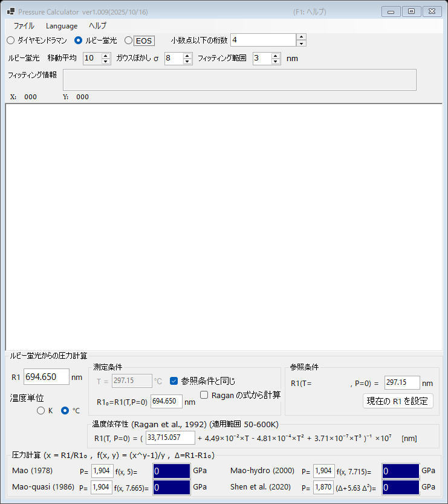

# PressureCalculator

PressureCalculator は、高圧発生実験（ダイヤモンドアンビルセル実験など）における圧力決定のための無償の Windows アプリケーションです。相補的な 3 つの方法をサポートしています。

- **[ルビー蛍光](1-ruby-fluorescence.md)** : ルビーの R1 蛍光線のシフトから圧力を求めます。複数のルビースケールと温度補正に対応しています。
- **[ダイヤモンドラマンエッジ](2-diamond-raman.md)** : ダイヤモンドアンビルのラマンバンドの高波数側エッジから圧力を求めます。
- **[状態方程式 (EOS)](3-equation-of-states.md)** : 金・白金・NaCl・ペリクレースなどの標準物質の格子定数（または単位胞体積）の測定値から圧力を求めます。

測定スペクトルはテキストファイルから読み込み、アプリ内で平滑化・フィッティングできます（[スペクトルとフィッティング](4-spectra-and-fitting.md)参照）。

{width=700px}

## インストール

最新版は [GitHub リリースページ](https://github.com/seto77/PressureCalculator/releases/latest) からダウンロードできます。

| ファイル | 説明 |
|---|---|
| `PressureCalculator-setup.msi` | **推奨。** 通常の (x64) Windows PC 用インストーラ。 |
| `PressureCalculator-setup_arm64.msi` | Windows on Arm (Snapdragon 搭載 PC、仮想化環境で Windows を動かす Apple Silicon Mac など) 用インストーラ。 |
| `PressureCalculator-v.X.zip` | ポータブル版 (x64): インストール不要・自己完結型。管理者権限のない PC に適しています。 |
| `PressureCalculator-v.X_arm64.zip` | Windows on Arm 用ポータブル版。 |

MSI インストーラ版の実行には .NET Desktop Runtime 10 が必要です。未インストールの場合は初回起動時にダウンロードリンク付きのダイアログが表示されます。ポータブル ZIP 版はランタイム同梱のため追加インストール不要で、書き込み可能なフォルダに展開して `PressureCalculator.exe` を実行するだけです。

PressureCalculator はユーザー単位でインストールされ（管理者権限不要）、設定は `HKEY_CURRENT_USER\Software\Crystallography\PressureCalculator` に保存されます。

## 表示言語

ユーザーインターフェースは 11 言語に対応しています。メニューバーの **Language** から言語を選ぶと、PressureCalculator が新しい言語で再起動します。アプリから開いた場合、本オンラインマニュアルも同じ言語で表示されます。

## オンラインヘルプ

アプリで ++f1++ を押す（またはメニューの **ヘルプ → オンラインマニュアル** を選ぶ）と、現在のモードに対応するマニュアルページが開きます。
