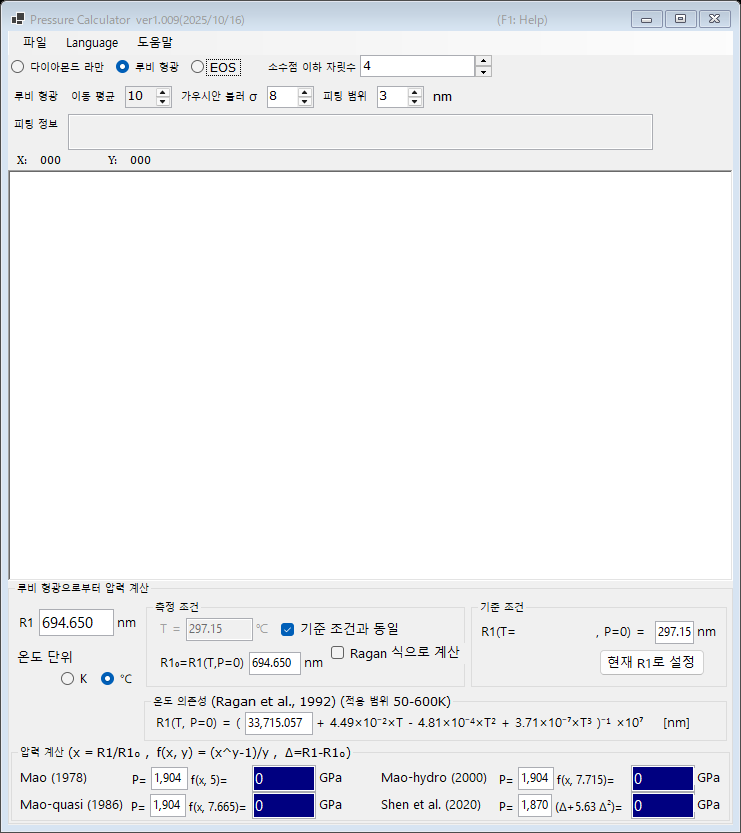

# 1. 루비 형광

다이아몬드 앤빌 셀 실험에서 가장 널리 쓰이는 압력 게이지인 루비 R1 형광선의 이동으로부터 압력을 결정합니다. 메인 창 상단에서 **루비 형광**을 선택하십시오.

{width=700px}

## 작업 절차

1. 형광 스펙트럼을 불러오거나([스펙트럼과 피팅](4-spectra-and-fitting.md) 참조), **R1** 상자에 R1 파장을 직접 입력합니다 (nm 단위).
2. 스펙트럼을 불러오면 PressureCalculator가 **피팅 범위** 안에서 R1·R2 선을 피팅하고(선형 배경을 포함한 pseudo-Voigt 프로파일), 피팅된 피크 위치와 폭을 **피팅 정보** 상자에 표시합니다.
3. **기준 조건** 그룹에서 기준 조건(압력 0에서의 R1 파장 **R1₀**)을 설정합니다. **현재 R1로 설정**을 누르면 현재 피팅된 R1이 기준 상자에 복사됩니다.
4. 각 루비 스케일로 계산된 압력이 **압력 계산** 그룹에 표시됩니다 (GPa 단위).

## 루비 스케일

압력은 다음 식으로 계산됩니다.

$$P = \frac{A}{y}\left[\left(\frac{R1}{R1_0}\right)^{y} - 1\right]$$

파라미터 세트는 다음과 같습니다(계수는 편집할 수 있습니다).

| 스케일 | 비고 |
|---|---|
| Mao (1978) | A = 1904 GPa, y = 5 |
| Mao-quasi (1986) | 준정수압 조건, y = 7.665 |
| Mao-hydro (2000) | 정수압 조건, y = 7.715 |
| Shen et al. (2020) | 국제 실용 루비 스케일, P = 1870 × Δ(1 + 5.63 Δ), Δ = (R1 − R1₀)/R1₀ |

## 온도 보정

R1 선은 온도에 따라서도 이동합니다. **온도 의존성 (Ragan et al., 1992)** 그룹은 측정 온도와 기준 온도를 사용하여 이 효과를 보정합니다. 적용 범위는 50-600 K입니다.

- **온도 단위** : 켈빈 또는 섭씨.
- **기준 조건과 동일** : 측정 온도가 기준 온도와 같다고 간주합니다.
- **Ragan 식으로 계산** : R1₀를 직접 입력하는 대신, 주어진 온도에서의 값을 Ragan 식으로 계산합니다.
