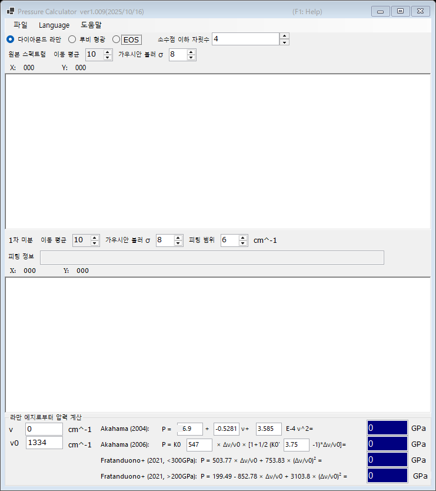

# 2. 다이아몬드 라만 에지

다이아몬드 앤빌 라만 밴드의 고파수 쪽 에지로부터 압력을 추정합니다. 이 에지는 큘렛(culet) 면의 수직 응력을 반영합니다. 루비 형광이 약해지는 초고압 영역에서 편리한 게이지입니다. 메인 창 상단에서 **다이아몬드 라만**을 선택하십시오.

{width=700px}

## 작업 절차

1. 다이아몬드 앤빌의 라만 스펙트럼을 불러옵니다([스펙트럼과 피팅](4-spectra-and-fitting.md) 참조). 위쪽 그래프에 원본(평활화된) 스펙트럼이 표시됩니다.
2. 아래쪽 그래프에는 스펙트럼의 **1차 미분**이 표시됩니다. 고파수 쪽 에지는 미분의 극소로 나타나며, PressureCalculator가 **피팅 범위** 안에서 이를 피팅하여 에지 위치를 **피팅 정보** 상자에 표시합니다.
3. 기준 파수 **ν₀**(압력 0에서의 라만 에지, 기본값 1334 cm⁻¹)를 설정하고, 필요하면 측정된 에지 **ν**를 직접 수정합니다.
4. 각 스케일로 계산된 압력이 **라만 에지로부터 압력 계산** 그룹에 표시됩니다 (GPa 단위).

원본 스펙트럼과 미분은 각각 **이동 평균**과 **가우시안 블러 σ**로 독립적으로 평활화할 수 있습니다([스펙트럼과 피팅](4-spectra-and-fitting.md) 참조).

## 라만 에지 스케일

| 스케일 | 비고 |
|---|---|
| Akahama (2004) | 에지 위치의 다항식. 계수는 편집할 수 있습니다 |
| Akahama (2006) | P = K₀ x [1 + ½(K₀′ − 1) x], x = Δν/ν₀. K₀ (547 GPa)와 K₀′ (3.75)는 편집 가능. 수백 GPa(멀티메가바) 영역까지 보정되어 있습니다 |
| Fratanduono et al. (2021, <300 GPa) | P = 503.77 x + 753.83 x² |
| Fratanduono et al. (2021, >200 GPa) | P = 199.49 − 852.78 x + 3103.8 x² |

Fratanduono et al. (2021)의 두 분지는 200-300 GPa 구간에서 겹칩니다. 사용하는 압력 범위에 맞는 분지를 선택하십시오.
