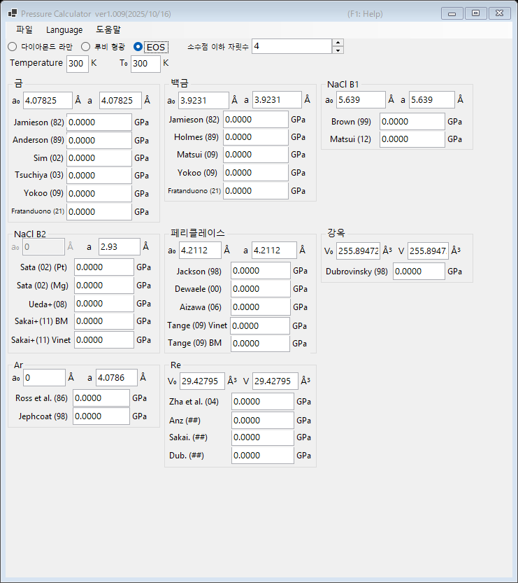

# 3. 상태방정식 (EOS)

발표된 상태방정식을 이용하여 표준 물질의 격자 상수(또는 단위포 부피) 측정값으로부터 압력을 결정합니다. 고압 X선 회절 실험에서 표준적으로 쓰이는 방법입니다. 메인 창 상단에서 **EOS**를 선택하십시오.

{width=700px}

## 작업 절차

1. 측정 온도 **Temperature**와 기준 온도 **T₀**를 입력합니다 (K 단위). 열 상태방정식은 이 값을 사용하며, 상온 스케일에서는 온도 차이가 무시됩니다.
2. 각 표준 물질에 대해 상압에서의 격자 상수 **a₀** (Å)와 측정된 격자 상수 **a** (Å)를 입력합니다. 강옥과 레늄은 대신 단위포 부피 **V₀**·**V** (ų)를 입력합니다.
3. 발표된 각 스케일로 계산된 압력이 즉시 표시됩니다 (GPa 단위).

## 사용 가능한 표준 물질과 스케일

| 물질 | 스케일 |
|---|---|
| 금 | Jamieson (1982), Anderson (1989), Sim (2002), Tsuchiya (2003), Yokoo (2009), Fratanduono (2021) |
| 백금 | Jamieson (1982), Holmes (1989), Matsui (2009), Yokoo (2009), Fratanduono (2021) |
| NaCl B1 | Brown (1999), Matsui (2012) |
| NaCl B2 | Sata (2002) (Pt/Mg 압력 기준), Ueda+ (2008), Sakai+ (2011) BM/Vinet |
| 페리클레이스 (MgO) | Jackson (1998), Dewaele (2000), Aizawa (2006), Tange (2009) Vinet/BM |
| 강옥 (Al₂O₃) | Dubrovinsky (1998) |
| Ar | Ross et al. (1986), Jephcoat (1998) |
| Re | Zha et al. (2004) 외 |
| Mo | Zhao+ (2000), Huang+ (2016) MGD |
| Pb | Strässle+ (2014) |

!!! note
    같은 물질이라도 스케일에 따라, 특히 수백 GPa(멀티메가바) 영역에서는 몇 % 정도의 차이가 생길 수 있습니다. 결과를 발표할 때는 어떤 스케일을 사용했는지 명시해 주십시오.
