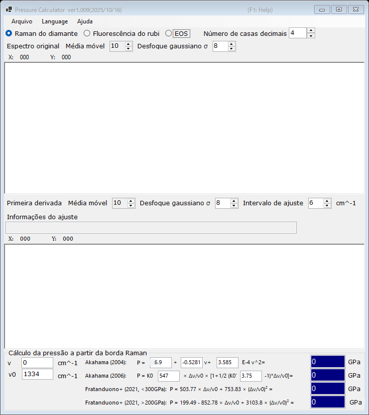

# 2. Borda Raman do diamante

A pressão é estimada a partir da borda de alta frequência da banda Raman da bigorna de diamante, que acompanha a tensão normal na face do culet. Esse medidor é conveniente em pressões muito altas, nas quais a fluorescência do rubi se torna fraca. Selecione **Raman do diamante** na parte superior da janela principal.

{width=700px}

## Fluxo de trabalho

1. Carregue um espectro Raman da bigorna de diamante (consulte [Espectros e ajuste](4-spectra-and-fitting.md)). O gráfico superior mostra o espectro original (suavizado).
2. O gráfico inferior mostra a **Primeira derivada** do espectro. A borda de alta frequência aparece como um mínimo da derivada; o PressureCalculator a ajusta dentro do **Intervalo de ajuste** e informa a posição da borda na caixa **Informações do ajuste**.
3. Defina o número de onda de referência **ν₀** (a borda Raman à pressão zero; 1334 cm⁻¹ por padrão) e, se necessário, edite diretamente a borda medida **ν**.
4. A pressão calculada com cada escala é exibida no grupo **Cálculo da pressão a partir da borda Raman** (em GPa).

Tanto o espectro original quanto a derivada podem ser suavizados de forma independente com uma **Média móvel** e um **Desfoque gaussiano σ** (consulte [Espectros e ajuste](4-spectra-and-fitting.md)).

## Escalas da borda Raman

| Escala | Observação |
|---|---|
| Akahama (2004) | polinômio na posição da borda; os coeficientes são editáveis |
| Akahama (2006) | P = K₀ x [1 + ½(K₀′ − 1) x], x = Δν/ν₀, com K₀ (547 GPa) e K₀′ (3.75) editáveis; calibrada até a faixa de vários megabars |
| Fratanduono et al. (2021, <300 GPa) | P = 503.77 x + 753.83 x² |
| Fratanduono et al. (2021, >200 GPa) | P = 199.49 − 852.78 x + 3103.8 x² |

Os dois ramos de Fratanduono et al. (2021) se sobrepõem entre 200 e 300 GPa; use o ramo apropriado para a sua faixa de pressão.
