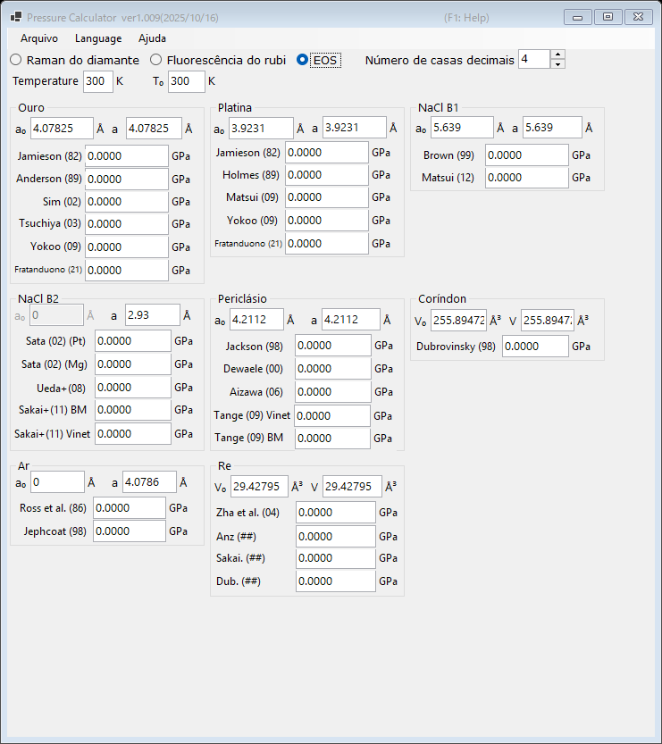

# 3. Equação de estado (EOS)

A pressão é determinada a partir do parâmetro de rede (ou do volume da célula unitária) medido de um material padrão, usando equações de estado publicadas. Esse é o método padrão em experimentos de difração de raios X sob alta pressão. Selecione **EOS** na parte superior da janela principal.

{width=700px}

## Fluxo de trabalho

1. Insira a temperatura de medição **Temperature** e a temperatura de referência **T₀** (em K). As equações de estado térmicas as utilizam; as escalas à temperatura ambiente ignoram a diferença.
2. Para cada material padrão, insira o parâmetro de rede em condições ambientes **a₀** (Å) e o parâmetro de rede medido **a** (Å). Para o coríndon e o rênio, são inseridos, em vez disso, os volumes da célula unitária **V₀** e **V** (ų).
3. A pressão calculada com cada escala publicada é exibida imediatamente (em GPa).

## Padrões e escalas disponíveis

| Material | Escalas |
|---|---|
| Ouro | Jamieson (1982), Anderson (1989), Sim (2002), Tsuchiya (2003), Yokoo (2009), Fratanduono (2021) |
| Platina | Jamieson (1982), Holmes (1989), Matsui (2009), Yokoo (2009), Fratanduono (2021) |
| NaCl B1 | Brown (1999), Matsui (2012) |
| NaCl B2 | Sata (2002) (referências de pressão Pt/Mg), Ueda+ (2008), Sakai+ (2011) BM/Vinet |
| Periclásio (MgO) | Jackson (1998), Dewaele (2000), Aizawa (2006), Tange (2009) Vinet/BM |
| Coríndon (Al₂O₃) | Dubrovinsky (1998) |
| Ar | Ross et al. (1986), Jephcoat (1998) |
| Re | Zha et al. (2004) e outros |
| Mo | Zhao+ (2000), Huang+ (2016) MGD |
| Pb | Strässle+ (2014) |

!!! note
    Escalas diferentes para o mesmo material podem diferir em vários por cento, especialmente em pressões de vários megabars. Informe qual escala foi usada ao publicar os resultados.
