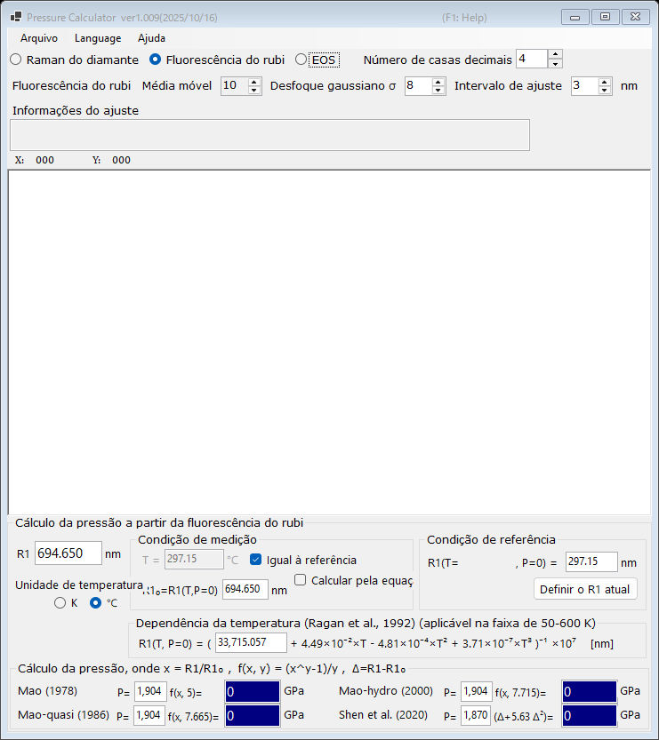

# PressureCalculator

O PressureCalculator é um aplicativo gratuito para Windows destinado à determinação da pressão em experimentos de alta pressão (como experimentos com célula de bigorna de diamante). Ele oferece três métodos complementares:

- **[Fluorescência do rubi](1-ruby-fluorescence.md)** : pressão a partir do deslocamento da linha de fluorescência R1 do rubi, com várias escalas de rubi publicadas e correção de temperatura.
- **[Borda Raman do diamante](2-diamond-raman.md)** : pressão a partir da borda de alta frequência da banda Raman da bigorna de diamante.
- **[Equação de estado (EOS)](3-equation-of-states.md)** : pressão a partir do parâmetro de rede (ou do volume da célula unitária) medido de materiais padrão como ouro, platina, NaCl, periclásio, entre outros.

Os espectros medidos podem ser carregados de arquivos de texto, suavizados e ajustados diretamente no aplicativo; consulte [Espectros e ajuste](4-spectra-and-fitting.md).

{width=700px}

## Instalação

Baixe a versão mais recente na [página de releases do GitHub](https://github.com/seto77/PressureCalculator/releases/latest).

| Arquivo | Descrição |
|---|---|
| `PressureCalculator-setup.msi` | **Recomendado.** Instalador para PCs Windows comuns (x64). |
| `PressureCalculator-setup_arm64.msi` | Instalador para Windows on Arm (PCs com Snapdragon, Macs com Apple Silicon executando o Windows por virtualização etc.). |
| `PressureCalculator-v.X.zip` | Versão portátil (x64): sem instalação, autocontida. Adequada para PCs em que você não tem direitos de administrador. |
| `PressureCalculator-v.X_arm64.zip` | Versão portátil para Windows on Arm. |

O instalador MSI requer o .NET Desktop Runtime 10; se ele não estiver instalado, o Windows exibe, na primeira execução, uma caixa de diálogo com um link para download. Os pacotes ZIP portáteis já incluem o runtime, de modo que nenhuma instalação adicional é necessária: basta extrair o ZIP em uma pasta com permissão de escrita e executar `PressureCalculator.exe`.

O PressureCalculator é instalado por usuário (sem necessidade de direitos de administrador) e armazena suas configurações em `HKEY_CURRENT_USER\Software\Crystallography\PressureCalculator`.

## Idioma de exibição

A interface do usuário está disponível em 11 idiomas. Escolha **Language** na barra de menus e selecione um idioma; o PressureCalculator será reiniciado no novo idioma. Este manual on-line acompanha a mesma seleção de idioma quando aberto a partir do aplicativo.

## Ajuda on-line

Pressione ++f1++ (ou escolha **Ajuda → Manual on-line**) no aplicativo para abrir a página do manual correspondente ao modo atual.
