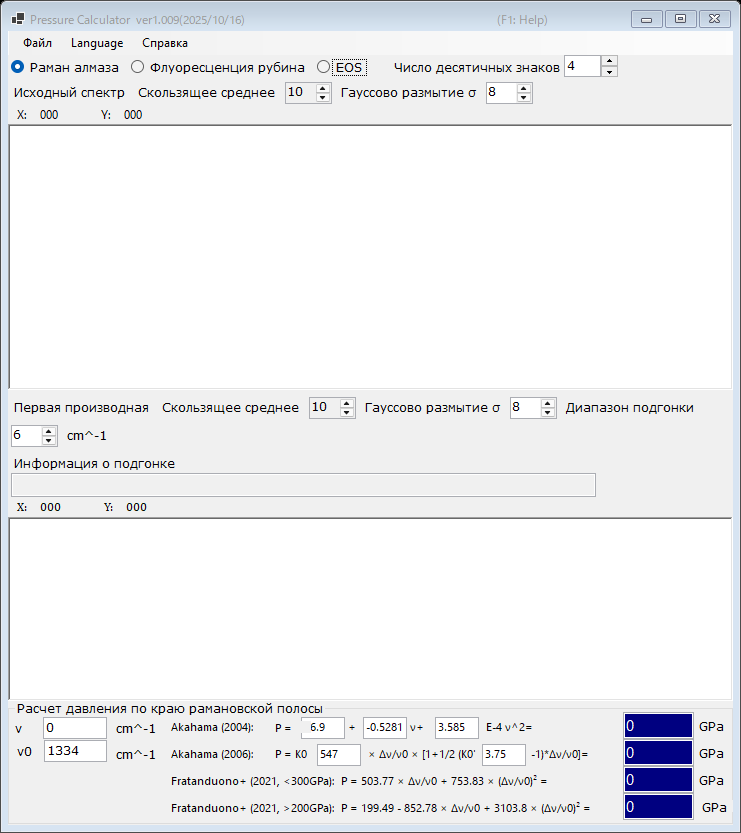

# 2. Край рамановской полосы алмаза

Давление оценивается по высокочастотному краю рамановской полосы алмазной наковальни, который отслеживает нормальное напряжение на кулете (рабочей площадке) наковальни. Этот датчик удобен при очень высоких давлениях, когда флуоресценция рубина становится слабой. Выберите **Раман алмаза** в верхней части главного окна.

{width=700px}

## Порядок работы

1. Загрузите рамановский спектр алмазной наковальни (см. [Спектры и подгонка](4-spectra-and-fitting.md)). На верхнем графике отображается исходный (сглаженный) спектр.
2. На нижнем графике отображается **Первая производная** спектра. Высокочастотный край проявляется как минимум производной; PressureCalculator подгоняет его в пределах интервала, заданного в поле **Диапазон подгонки**, и выводит положение края в поле **Информация о подгонке**.
3. Задайте эталонное волновое число **ν₀** (положение края рамановской полосы при нулевом давлении; по умолчанию 1334 cm⁻¹) и при необходимости отредактируйте измеренное значение края **ν** напрямую.
4. Давление, рассчитанное по каждой шкале, отображается в группе **Расчет давления по краю рамановской полосы** (в GPa).

И исходный спектр, и производную можно сглаживать независимо с помощью параметров **Скользящее среднее** и **Гауссово размытие σ** (см. [Спектры и подгонка](4-spectra-and-fitting.md)).

## Шкалы по краю рамановской полосы

| Шкала | Примечание |
|---|---|
| Akahama (2004) | полином от положения края; коэффициенты доступны для редактирования |
| Akahama (2006) | P = K₀ x [1 + ½(K₀′ − 1) x], x = Δν/ν₀, с редактируемыми K₀ (547 GPa) и K₀′ (3.75); откалибрована вплоть до мультимегабарного диапазона |
| Fratanduono et al. (2021, <300 GPa) | P = 503.77 x + 753.83 x² |
| Fratanduono et al. (2021, >200 GPa) | P = 199.49 − 852.78 x + 3103.8 x² |

Две ветви шкалы Fratanduono et al. (2021) перекрываются между 200 и 300 GPa; используйте ветвь, соответствующую вашему диапазону давлений.
