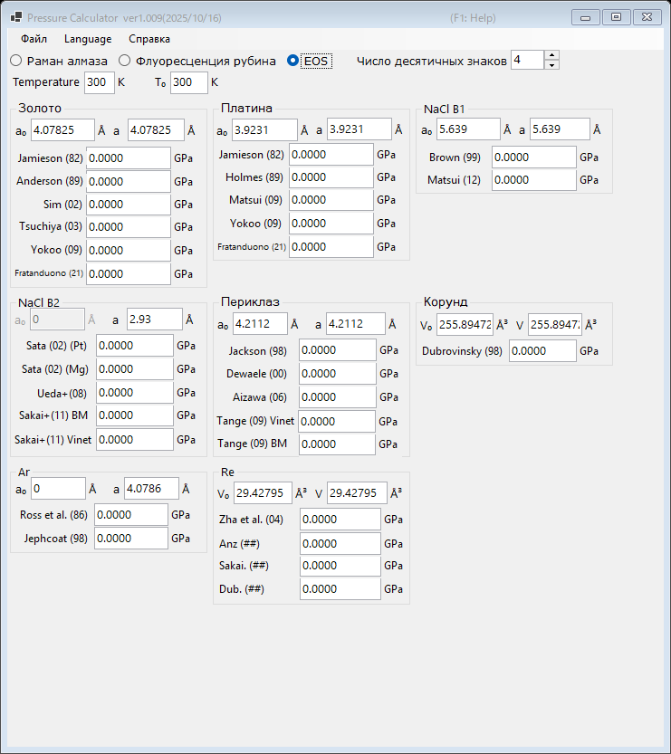

# 3. Уравнение состояния (EOS)

Давление определяется по измеренному параметру решетки (или объему элементарной ячейки) стандартного материала с использованием опубликованных уравнений состояния. Это стандартный метод в рентгенодифракционных экспериментах при высоких давлениях. Выберите **EOS** в верхней части главного окна.

{width=700px}

## Порядок работы

1. Введите температуру измерения **Temperature** и эталонную температуру **T₀** (в K). Термические уравнения состояния используют эти значения; шкалы для комнатной температуры игнорируют их различие.
2. Для каждого стандартного материала введите параметр решетки при атмосферном давлении **a₀** (Å) и измеренный параметр решетки **a** (Å). Для корунда и рения вместо этого вводятся объемы элементарной ячейки **V₀** и **V** (ų).
3. Давление, рассчитанное по каждой опубликованной шкале, отображается сразу же (в GPa).

## Доступные стандартные материалы и шкалы

| Материал | Шкалы |
|---|---|
| Золото | Jamieson (1982), Anderson (1989), Sim (2002), Tsuchiya (2003), Yokoo (2009), Fratanduono (2021) |
| Платина | Jamieson (1982), Holmes (1989), Matsui (2009), Yokoo (2009), Fratanduono (2021) |
| NaCl B1 | Brown (1999), Matsui (2012) |
| NaCl B2 | Sata (2002) (реперы давления Pt/Mg), Ueda+ (2008), Sakai+ (2011) BM/Vinet |
| Периклаз (MgO) | Jackson (1998), Dewaele (2000), Aizawa (2006), Tange (2009) Vinet/BM |
| Корунд (Al₂O₃) | Dubrovinsky (1998) |
| Ar | Ross et al. (1986), Jephcoat (1998) |
| Re | Zha et al. (2004) и другие |
| Mo | Zhao+ (2000), Huang+ (2016) MGD |
| Pb | Strässle+ (2014) |

!!! note
    Разные шкалы для одного и того же материала могут расходиться на несколько процентов, особенно при мультимегабарных давлениях. При публикации результатов указывайте, какая шкала была использована.
