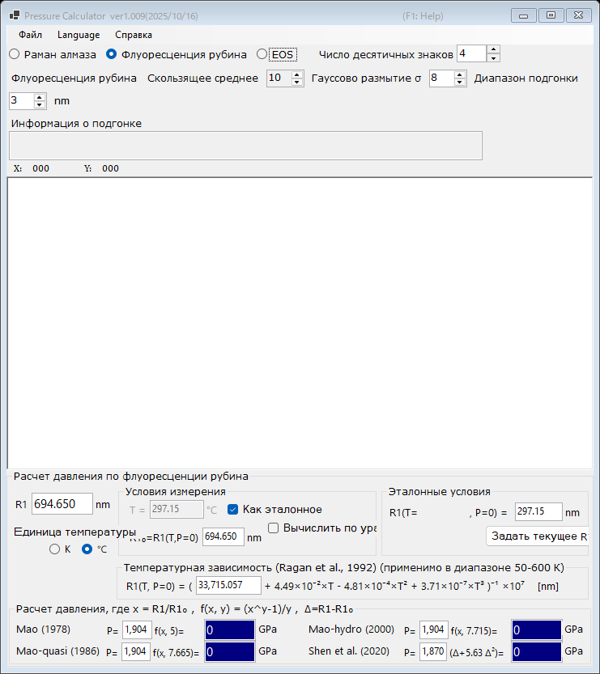

# PressureCalculator

PressureCalculator — бесплатное Windows-приложение для определения давления в экспериментах при высоких давлениях (например, в экспериментах с ячейками с алмазными наковальнями). Оно поддерживает три взаимодополняющих метода:

- **[Флуоресценция рубина](1-ruby-fluorescence.md)** : давление по сдвигу линии флуоресценции R1 рубина, с несколькими опубликованными рубиновыми шкалами и температурной поправкой.
- **[Край рамановской полосы алмаза](2-diamond-raman.md)** : давление по высокочастотному краю рамановской полосы алмазной наковальни.
- **[Уравнение состояния (EOS)](3-equation-of-states.md)** : давление по измеренному параметру решетки (или объему элементарной ячейки) стандартных материалов, таких как золото, платина, NaCl, периклаз и другие.

Измеренные спектры можно загружать из текстовых файлов, сглаживать и подгонять непосредственно в приложении; см. [Спектры и подгонка](4-spectra-and-fitting.md).

{width=700px}

## Установка

Загрузите последнюю версию со [страницы GitHub Releases](https://github.com/seto77/PressureCalculator/releases/latest).

| Файл | Описание |
|---|---|
| `PressureCalculator-setup.msi` | **Рекомендуется.** Установщик для обычных (x64) ПК с Windows. |
| `PressureCalculator-setup_arm64.msi` | Установщик для Windows on Arm (ПК на Snapdragon, компьютеры Mac с Apple Silicon, на которых Windows работает через виртуализацию, и т. п.). |
| `PressureCalculator-v.X.zip` | Портативная версия (x64): без установки, самодостаточная. Подходит для ПК, на которых у вас нет прав администратора. |
| `PressureCalculator-v.X_arm64.zip` | Портативная версия для Windows on Arm. |

Для работы установщика MSI требуется .NET Desktop Runtime 10; если он не установлен, Windows при первом запуске покажет диалоговое окно со ссылкой для загрузки. Портативные ZIP-пакеты включают среду выполнения, поэтому отдельная установка не нужна: просто распакуйте ZIP в папку, доступную для записи, и запустите `PressureCalculator.exe`.

PressureCalculator устанавливается для каждого пользователя отдельно (права администратора не требуются) и хранит настройки в разделе реестра `HKEY_CURRENT_USER\Software\Crystallography\PressureCalculator`.

## Язык интерфейса

Пользовательский интерфейс доступен на 11 языках. Выберите **Language** в строке меню и укажите язык; PressureCalculator перезапустится с новым языком. Настоящее онлайн-руководство при открытии из приложения отображается на том же выбранном языке.

## Онлайн-справка

Нажмите ++f1++ (или выберите **Справка → Онлайн-руководство**) в приложении, чтобы открыть страницу руководства, соответствующую текущему режиму.
