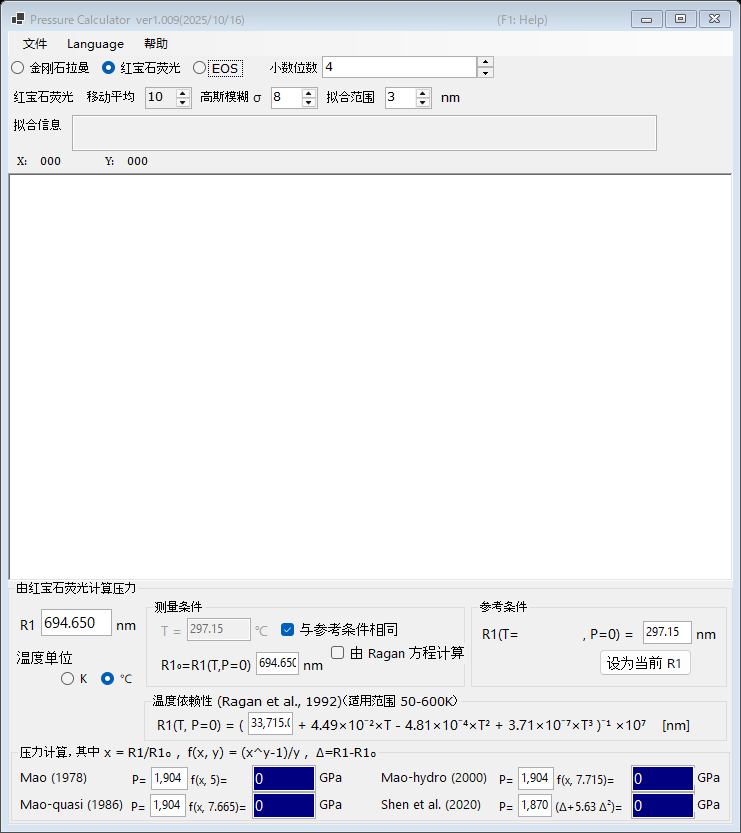

# 1. 红宝石荧光

压力由红宝石 R1 荧光线的移动确定，这是金刚石压砧实验中使用最广泛的压力计。请在主窗口顶部选择 **红宝石荧光**。

{width=700px}

## 操作流程

1. 加载荧光光谱（参见[光谱与拟合](4-spectra-and-fitting.md)），或直接在 **R1** 框中输入 R1 波长（单位 nm）。
2. 加载光谱后，PressureCalculator 会在 **拟合范围** 内对 R1 和 R2 谱线进行拟合（赝 Voigt 峰形 + 线性背景），并在 **拟合信息** 框中显示拟合得到的峰位和峰宽。
3. 在 **参考条件** 组中设置参考条件（零压下的 R1 波长 **R1₀**）。点击 **设为当前 R1** 可将当前拟合得到的 R1 复制到参考框中。
4. 各红宝石压标计算出的压力显示在 **压力计算** 组中（单位 GPa）。

## 红宝石压标

压力按下式计算

$$P = \frac{A}{y}\left[\left(\frac{R1}{R1_0}\right)^{y} - 1\right]$$

可选用以下参数组（系数均可编辑）：

| 压标 | 说明 |
|---|---|
| Mao (1978) | A = 1904 GPa, y = 5 |
| Mao-quasi (1986) | 准静水压条件，y = 7.665 |
| Mao-hydro (2000) | 静水压条件，y = 7.715 |
| Shen et al. (2020) | 国际实用红宝石压标，P = 1870 × Δ(1 + 5.63 Δ)，Δ = (R1 − R1₀)/R1₀ |

## 温度校正

R1 谱线的位置也会随温度移动。**温度依赖性 (Ragan et al., 1992)** 组利用测量温度和参考温度对该效应进行校正；适用范围为 50-600 K。

- **温度单位** : 开尔文或摄氏度。
- **与参考条件相同** : 假定测量温度与参考温度相同。
- **由 Ragan 方程计算** : 由 Ragan 方程计算给定温度下的 R1₀，而无需手动输入。
