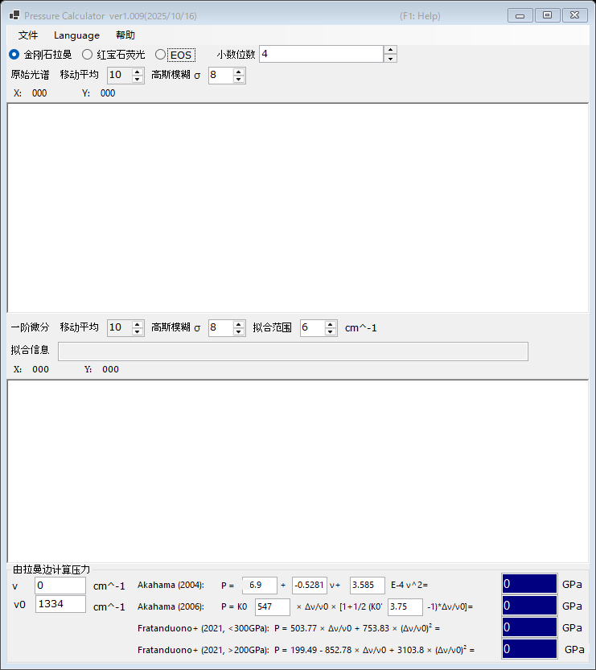

# 2. 金刚石拉曼边

金刚石压砧拉曼谱带的高频边反映砧面（culet）处的正应力，可据此估算压力。在红宝石荧光信号变弱的超高压区间，这种压力计尤为方便。请在主窗口顶部选择 **金刚石拉曼**。

{width=700px}

## 操作流程

1. 加载金刚石压砧的拉曼光谱（参见[光谱与拟合](4-spectra-and-fitting.md)）。上方图形显示原始（平滑后的）光谱。
2. 下方图形显示光谱的 **一阶微分**。高频边表现为微分曲线的极小值；PressureCalculator 会在 **拟合范围** 内对其进行拟合，并在 **拟合信息** 框中给出边缘位置。
3. 设置参考波数 **ν₀**（零压下的拉曼边；默认值 1334 cm⁻¹），必要时可直接编辑测得的边缘位置 **ν**。
4. 各压标计算出的压力显示在 **由拉曼边计算压力** 组中（单位 GPa）。

原始光谱和微分曲线可分别用 **移动平均** 和 **高斯模糊 σ** 独立平滑（参见[光谱与拟合](4-spectra-and-fitting.md)）。

## 拉曼边压标

| 压标 | 说明 |
|---|---|
| Akahama (2004) | 关于边缘位置的多项式；系数可编辑 |
| Akahama (2006) | P = K₀ x [1 + ½(K₀′ − 1) x]，x = Δν/ν₀，K₀ (547 GPa) 与 K₀′ (3.75) 可编辑；标定范围可达数百 GPa |
| Fratanduono et al. (2021, <300 GPa) | P = 503.77 x + 753.83 x² |
| Fratanduono et al. (2021, >200 GPa) | P = 199.49 − 852.78 x + 3103.8 x² |

Fratanduono et al. (2021) 的两个分支在 200-300 GPa 之间相互重叠；请根据所处的压力范围选用合适的分支。
