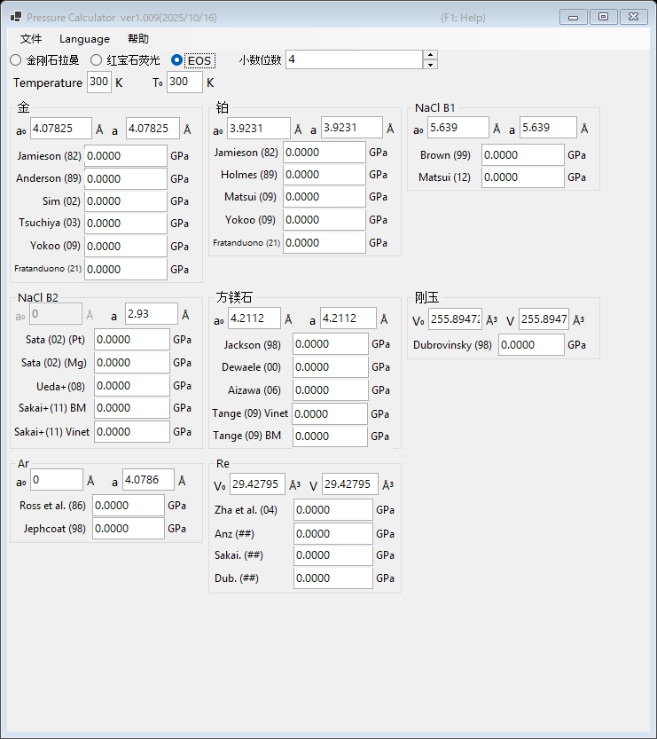

# 3. 状态方程 (EOS)

利用已发表的状态方程，由标准物质晶格常数（或晶胞体积）的测量值确定压力。这是高压 X 射线衍射实验中的标准方法。请在主窗口顶部选择 **EOS**。

{width=700px}

## 操作流程

1. 输入测量温度 **Temperature** 和参考温度 **T₀**（单位 K）。热状态方程会使用这两个温度；室温压标则忽略其差异。
2. 对每种标准物质，输入常压下的晶格常数 **a₀** (Å) 和测得的晶格常数 **a** (Å)。刚玉和铼则改为输入晶胞体积 **V₀** 和 **V** (ų)。
3. 各已发表压标计算出的压力会立即显示（单位 GPa）。

## 可用的标准物质与压标

| 物质 | 压标 |
|---|---|
| 金 | Jamieson (1982), Anderson (1989), Sim (2002), Tsuchiya (2003), Yokoo (2009), Fratanduono (2021) |
| 铂 | Jamieson (1982), Holmes (1989), Matsui (2009), Yokoo (2009), Fratanduono (2021) |
| NaCl B1 | Brown (1999), Matsui (2012) |
| NaCl B2 | Sata (2002)（Pt/Mg 压力参考）, Ueda+ (2008), Sakai+ (2011) BM/Vinet |
| 方镁石 (MgO) | Jackson (1998), Dewaele (2000), Aizawa (2006), Tange (2009) Vinet/BM |
| 刚玉 (Al₂O₃) | Dubrovinsky (1998) |
| Ar | Ross et al. (1986), Jephcoat (1998) |
| Re | Zha et al. (2004) 等 |
| Mo | Zhao+ (2000), Huang+ (2016) MGD |
| Pb | Strässle+ (2014) |

!!! note
    同一物质的不同压标之间可能相差百分之几，在数百 GPa 压力下尤为明显。发表结果时请注明所使用的压标。
