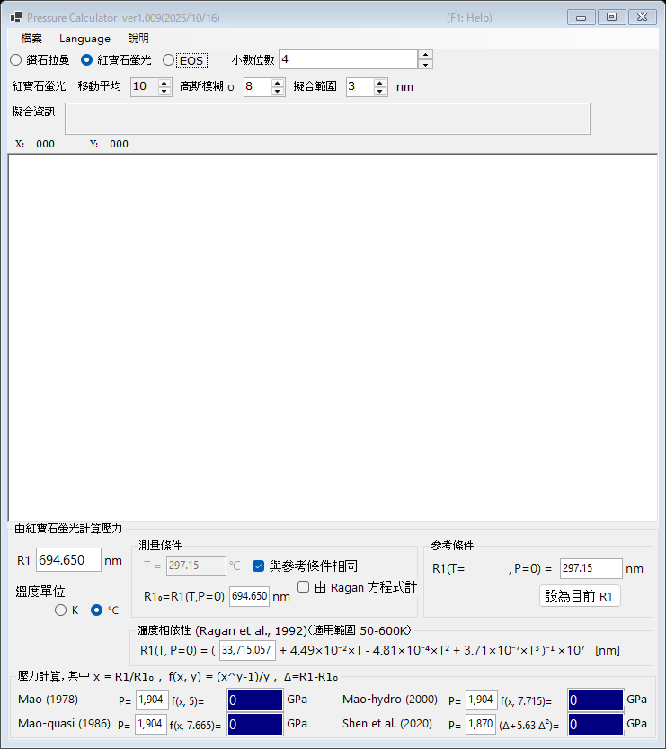

# 1. 紅寶石螢光

由紅寶石 R1 螢光線的位移決定壓力——這是鑽石壓砧實驗中最廣泛使用的壓力計。請在主視窗上方選擇 **紅寶石螢光**。

{width=700px}

## 操作流程

1. 載入螢光光譜（參見[光譜與擬合](4-spectra-and-fitting.md)），或直接在 **R1** 方塊中輸入 R1 波長（單位 nm）。
2. 載入光譜後，PressureCalculator 會在 **擬合範圍** 內擬合 R1 與 R2 線（pseudo-Voigt 峰形加線性背景），並將擬合所得的峰位置與寬度顯示於 **擬合資訊** 欄。
3. 在 **參考條件** 群組中設定參考條件（零壓下的 R1 波長 **R1₀**）。按 **設為目前 R1** 可將目前擬合出的 R1 複製到參考方塊。
4. 各紅寶石壓力標度計算出的壓力顯示於 **壓力計算** 群組（單位 GPa）。

## 紅寶石壓力標度

壓力依下式計算：

$$P = \frac{A}{y}\left[\left(\frac{R1}{R1_0}\right)^{y} - 1\right]$$

參數組如下（係數皆可編輯）：

| 標度 | 備註 |
|---|---|
| Mao (1978) | A = 1904 GPa, y = 5 |
| Mao-quasi (1986) | 準靜水壓條件, y = 7.665 |
| Mao-hydro (2000) | 靜水壓條件, y = 7.715 |
| Shen et al. (2020) | 國際實用紅寶石壓力標度, P = 1870 × Δ(1 + 5.63 Δ), Δ = (R1 − R1₀)/R1₀ |

## 溫度修正

R1 線也會隨溫度而位移。**溫度相依性 (Ragan et al., 1992)** 群組使用測量溫度與參考溫度來修正此效應；適用範圍為 50-600 K。

- **溫度單位** : 克耳文（Kelvin）或攝氏。
- **與參考條件相同** : 假設測量溫度等於參考溫度。
- **由 Ragan 方程式計算** : 不以手動輸入 R1₀，而是由 Ragan 方程式計算指定溫度下的值。
