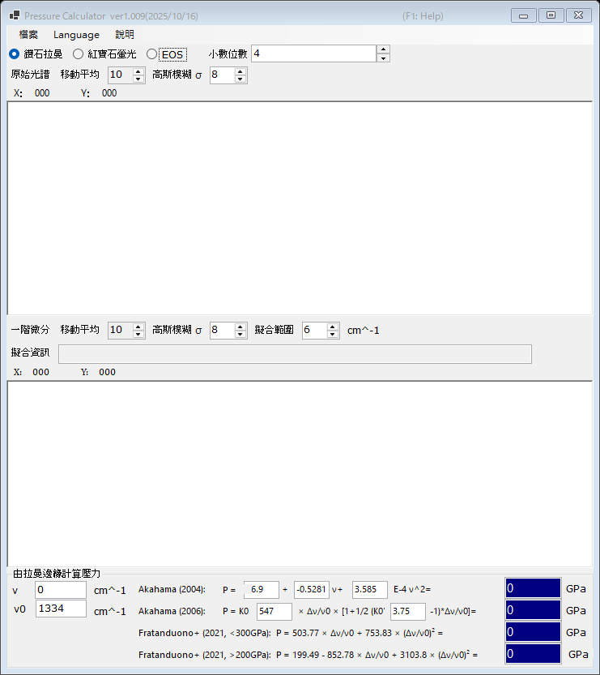

# 2. 鑽石拉曼邊緣

由鑽石壓砧拉曼帶的高波數側邊緣估算壓力，該邊緣反映砧面（culet）上的法向應力。在紅寶石螢光訊號變弱的極高壓下，此壓力計十分方便。請在主視窗上方選擇 **鑽石拉曼**。

{width=700px}

## 操作流程

1. 載入鑽石壓砧的拉曼光譜（參見[光譜與擬合](4-spectra-and-fitting.md)）。上方圖表顯示原始（平滑化後的）光譜。
2. 下方圖表顯示光譜的 **一階微分**。高波數側邊緣對應微分曲線的極小值；PressureCalculator 會在 **擬合範圍** 內加以擬合，並將邊緣位置顯示於 **擬合資訊** 欄。
3. 設定參考波數 **ν₀**（零壓下的拉曼邊緣；預設為 1334 cm⁻¹），必要時可直接編輯測得的邊緣 **ν**。
4. 各標度計算出的壓力顯示於 **由拉曼邊緣計算壓力** 群組（單位 GPa）。

原始光譜與微分曲線可分別以 **移動平均** 與 **高斯模糊 σ** 獨立進行平滑化（參見[光譜與擬合](4-spectra-and-fitting.md)）。

## 拉曼邊緣標度

| 標度 | 備註 |
|---|---|
| Akahama (2004) | 邊緣位置的多項式；係數可編輯 |
| Akahama (2006) | P = K₀ x [1 + ½(K₀′ − 1) x], x = Δν/ν₀，K₀ (547 GPa) 與 K₀′ (3.75) 可編輯；校準範圍達數百 GPa（multimegabar）的超高壓區 |
| Fratanduono et al. (2021, <300 GPa) | P = 503.77 x + 753.83 x² |
| Fratanduono et al. (2021, >200 GPa) | P = 199.49 − 852.78 x + 3103.8 x² |

Fratanduono et al. (2021) 的兩個分支在 200-300 GPa 之間重疊；請依實驗的壓力範圍選用合適的分支。
