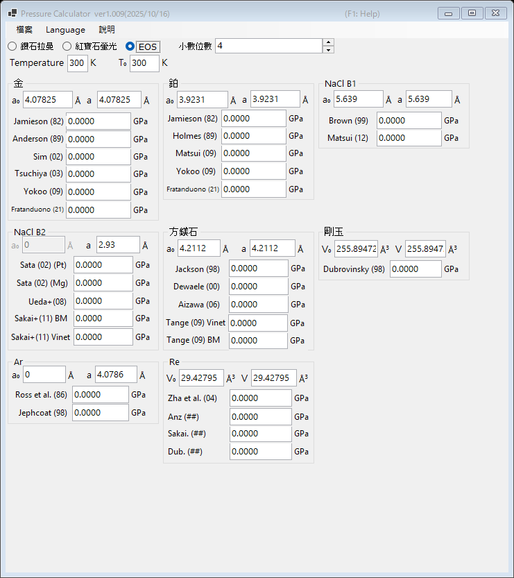

# 3. 狀態方程式 (EOS)

利用已發表的狀態方程式，由標準物質的晶格常數（或單位晶胞體積）測量值決定壓力。這是高壓 X 光繞射實驗中的標準方法。請在主視窗上方選擇 **EOS**。

{width=700px}

## 操作流程

1. 輸入測量溫度 **Temperature** 與參考溫度 **T₀**（單位 K）。熱狀態方程式會使用這兩個值；室溫標度則忽略其差異。
2. 對每種標準物質，輸入常壓下的晶格常數 **a₀** (Å) 與測得的晶格常數 **a** (Å)。剛玉與錸則改為輸入單位晶胞體積 **V₀** 與 **V** (ų)。
3. 各已發表標度計算出的壓力會立即顯示（單位 GPa）。

## 可用的標準物質與標度

| 物質 | 標度 |
|---|---|
| 金 | Jamieson (1982), Anderson (1989), Sim (2002), Tsuchiya (2003), Yokoo (2009), Fratanduono (2021) |
| 鉑 | Jamieson (1982), Holmes (1989), Matsui (2009), Yokoo (2009), Fratanduono (2021) |
| NaCl B1 | Brown (1999), Matsui (2012) |
| NaCl B2 | Sata (2002)（Pt/Mg 壓力參考）, Ueda+ (2008), Sakai+ (2011) BM/Vinet |
| 方鎂石 (MgO) | Jackson (1998), Dewaele (2000), Aizawa (2006), Tange (2009) Vinet/BM |
| 剛玉 (Al₂O₃) | Dubrovinsky (1998) |
| Ar | Ross et al. (1986), Jephcoat (1998) |
| Re | Zha et al. (2004) 等 |
| Mo | Zhao+ (2000), Huang+ (2016) MGD |
| Pb | Strässle+ (2014) |

!!! note
    同一物質的不同標度所得的壓力可能相差數個百分點，在數百 GPa（multimegabar）的超高壓下尤為明顯。發表結果時請註明所使用的標度。
